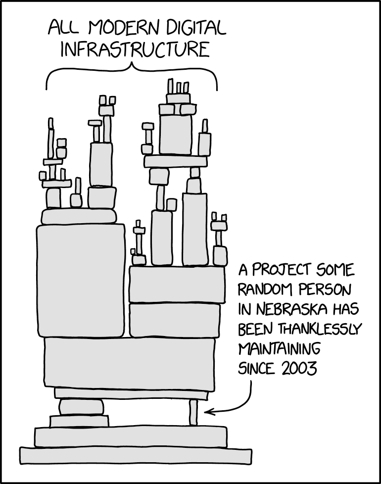
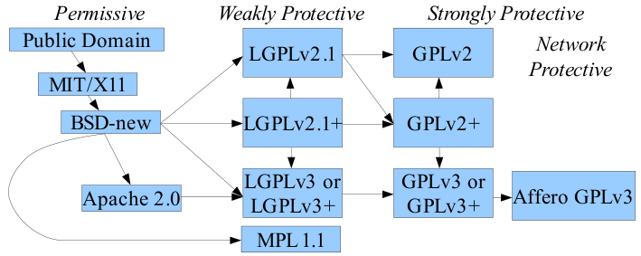

#section-slide("Exceptions")

#slide(title: "Die Idee")[
- Bisheriges Umgehen mit Fehlern:
    - Alle Fehlerquellen abfangen
    - Ungültigen Wert zurückgeben
- Aber das geht nicht immer
    - Oft zu viele mögliche Gründe für Fehler, um alle zu vermeiden
    - Es können alle Rückgabewerte sinnvoll sein
- Alternative: Neuer Informationskanal zusätzlich zu return

]

#slide(title: "Die Umsetzung")[
- Bei Auftreten eines Fehlers kann eine Exception geworfen werden:

  #sourcecode[```java
public class Divider {
    public static double divide(double a, double b) throws Exception {
        if(b == 0) {
            throw new Exception("Can't divide by zero");
        }
        return a/b;
    }
}
try {
	System.out.println(Divider.divide(7, 0));
} catch(Exception e) {
    System.out.println("Ups, Fehler: " + e.getMessage());
}
  ```]

]

#slide(title: "Regeln")[
- Wenn eine Methode eine Exception werfen kann, muss sie das mit `throws` in der Signatur ankündigen
- Wird eine Exception von einer Methode `a` geworfen, dann:
    - Ist das automatisch wie ein return an dieser Stelle
    - Wird die Exception an der Stelle, wo `a` aufgerufen wurde, sofort wieder geworfen
    - Die Kette wird erst durch ein passendes `catch` unterbrochen
- Alle Exceptions außer `RuntimeExceptions` wie `ArrayIndexOutOfBounds` müssen zwingend per `catch` gefangen werden, bevor sie aus der main-Methode fliegen können

]

#slide(title: "Live-Beispiel")[
- Generell überall sinnvoll, wo Fehler auftreten können (-> Algorithmus kann kein sinnvolles Ergebnis liefern)
- Eigene Ideen? 
- Sonst: Fibonacci-Folge berechnen, Exception bei:
  - Integer overflow
  - Negativer Eingabe

]

#section-slide("Dateien")

#slide(title: "Allgemeines")[
- Spezilalisierte Klassen für Dateioperationen:
    - Datei selber: `File`
    - Lesen: `FileReader` + `BufferedReader`
    - Schreiben: `FileWriter` + `BufferedWriter`
    - Werfen bei Fehlern (Datei existiert nicht, keine Berechtigung, Festplatte voll...) `IOException`
- Idee: `File` beschreibt Datei, `Reader`/`Writer` macht low-Level-Zugriff, `BufferedReader`/`BufferedWriter` bietet Komfort-Funktionen (z.B. zeilenweises Lesen)

]

#slide(title: "Code und Live-Beispiel")[
  #sourcecode[```java
public class TextReader {
	public static void printContents(String infile) {
		File f = new File(infile);
		try {
			BufferedReader r = new BufferedReader(new FileReader(f));
			while(r.ready()) {
				System.out.println(r.readLine());
			}
		}
		catch(IOException e) {
			e.printStackTrace();
		}
	}
}
  ```]

  Wie könnte man damit die Wörter in einer Datei zählen?

]

#section-slide("Nützliche Dinge")

#slide(title: "StringBuilder")[
- String hält intern ein `char[]`
    - immutable!
    - Scheinbare Veränderung = Inhalt kopieren + neuer String
- Effizienter Aufbau: `StringBuilder`
    - Erlaubt Hinzufügen von Textteilen
    - Werden am Ende mit `toString()` zusammengefügt
    - -> nur 1 Kopiervorgang

]

#slide(title: "StringBuilder")[
  #sourcecode[```java
double startTime = System.currentTimeMillis();
String text = "";
for(int i=0; i<100000; i++) {
    text += i + ",";
}
System.out.println(text.substring(0, 10));
System.out.println(System.currentTimeMillis() - startTime); // 4291 ms
startTime = System.currentTimeMillis();
StringBuilder textBuilder = new StringBuilder();
for(int i=0; i<100000; i++) {
    textBuilder.append(i + ",");
}
System.out.println(textBuilder.toString().substring(0, 10));
System.out.println(System.currentTimeMillis() - startTime); // 8 ms
  ```]

]

#slide(title: "Static-Attribute")[
Wichtig bei Attributen: Jedes Objekt hat eine eigene Kopie!

- Sinnvoll bei Eigenschaften des Objekts (ISBN des Buches)
- Aber schwierig, wenn Eigenschaft gemeinsam sein soll

Lösung: Statische Attribute:

- Markierung mittels `static`
- Alle Objekte haben gemeinsamen Wert!

]

#slide(title: "Static-Attribute")[
  #sourcecode[```java
public Class Book {
    private int ID;
    public static int numBooks = 0;
    public Book() {
        ID = numBooks;
        numBooks += 1;
    }
    public int getID() { return ID; } 
}
Book book1 = new Book();
System.out.println("Book 1 ID: " + book1.getID())
System.out.println("Total number of books: " + Book.numBooks); //nicht book1.
Book book2 = new Book();
System.out.println("Book 2 ID: " + book2.getID())
System.out.println("Total number of books: " + Book.numBooks);
  ```]

]

#slide(title: "Static-Methoden")[
- Methoden, die keinen Zugriff auf Attribute außer `static` brauchen
- Typisch:
    - Utility-Methoden, die logisch in die Klasse gehören
    - Ganze Utility-Klassen
    - Getter für statische Attribute

  #sourcecode[```java
public Class Book {
    private static int numBooks = 0;
    //...
    public static int getNumBooks() { return numBooks; } // kann static sein
}
  ```]

]

#slide(title: "Live-Beispiele für static")[
- Book - was passiert mit und ohne static?
- static als Fehlerquelle - PatientList.calculateMeanAge() mit Patient.age als static
- Singleton zum Verwalten von Einstellungen
- DateUtilities.getDay("12.07.2022") - ähnliche Logik wie Integer.parseInt("12")

]


## Externe Libraries

* Viele Leute haben ähnliche Probleme
* Immer das Rad neu zu erfinden ist ineffizient - "Wir stehen auf den Schultern von Giganten"
* Lösung in Programmierung: Bibliotheken ("Libraries")
    * Eigenen Code so verpacken, dass er einfach nachnutzbar ist
    * Fremde Libraries verwenden, wenn sinnvoll möglich
* In Java: JAR-Dateien

---



## Libraries: Sicherheit

* Nicht alle programmieren gut
* Projekte sind oft "Hobbies"
* Einige Kriterien:
    * Größe der Community
    * Verwendung in Projekten
    * Umgang mit issues (insbesondere security)
* Manchmal muss man das Rad doch neu erfinden...

---

## Libraries: Lizenzen

* Open Source vs. Closed Source
* Copyleft vs. Copyright
* Kompatibilität (-> immer eigene Lizenz setzen)!



---

## Letzte (Verständnis-)Fragen

* Jetzt Möglichkeit, noch offene Fragen vor der Prüfung zu klären!
* Ansonsten Programm für restliche Zeit:
    * Live gemeinsam Arbeit mit XChart anschauen
    * Durch Aufgabe von letzter Woche gehen
