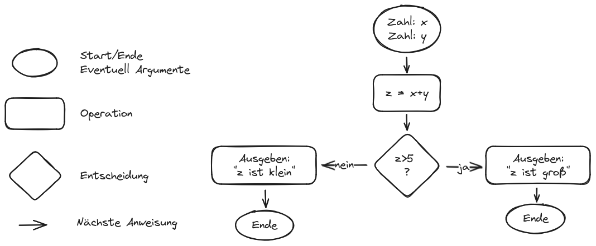
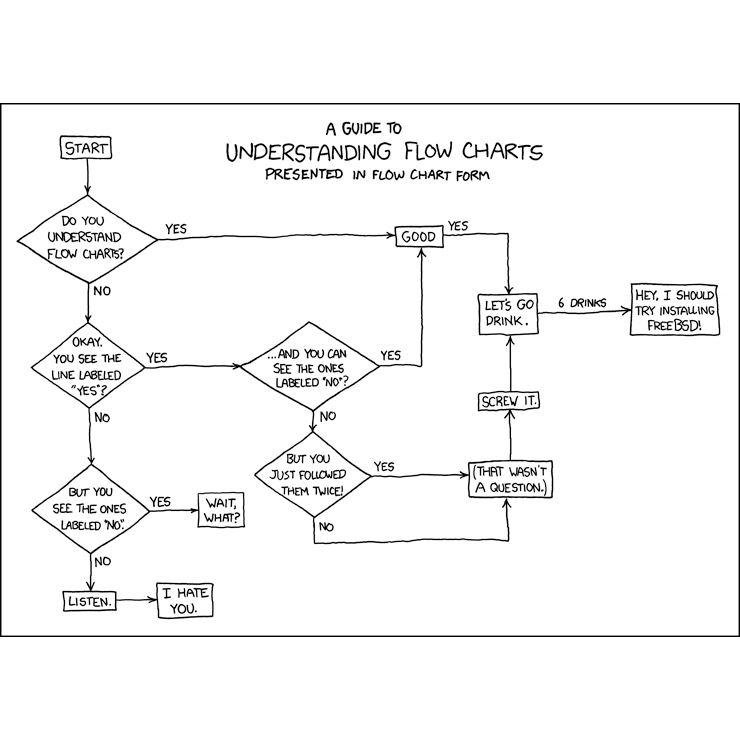

# Programmierung 1 - Was tun wir hier?

* Grundlagen des Programmierens (in Java) beherrschen
* Einfache Algorithmen selber ausdenken und implementieren
* Grundbegiffe der (objektorientierten) Programmierung beherrschen
* Desillusionierung:
  * Programmieren lernen ist zeitaufwendig!
  * Ich kann es Ihnen nicht beibringen!
* Wichtig: Ab Anfang konsequent mitmachen, gerne Laptop in die VL mitbringen

---

# Organisatorisches

* Selber programmieren wichtig -> 1 SWS VL, 3 SWS PCÜ
* Präsenzzeit reicht **nicht**!
  * Zusatzaufgaben zum selber üben, Tutorium 
  * Hausaufgaben - Prüfung ab 75% Abgaben, 50% Punkte
  * Fragen stellen (Forum, SL)! 
* Prüfungsleistung: Wie Hausaufgabe, aber größer (2 Wochen)
* Bonuspunkte für Verbesserungsvorschläge (siehe [git-repo](https://github.com/dabrowskiw/Programmierung1-Materialien)): 2.5% für Vorschlag, 5% für Code (mail, pull request), max. 2/Semester

---

# Fahrplan

* Was ist allgemein Programmierung?
* Visuelle Übungen mit "Snap!" + Flussdiagrammen (2 Wochen)
* "Fingerübungen" mit Java (ca. 4 Wochen)
* Anwendungsaufgaben (ca. 6-8 Wochen):
  * Arrays
  * Grundlagen der Objektorientierung
  * Externe Bibliotheken am Beispiel von Plots
* Puffer

---

# Was ist Programmierung?

* Wie mit jemandem reden, der gar nicht mitdenkt
* Anweisungen müssen extrem exakt formuliert sein
* Einfachste Herangehensweise:
  * Problem selber lösen
  * Sich selber dabei beobachten ("warum tue ich das gerade?")
  * Beobachtungen idiotensicher zum Nachkochen aufschreiben
-> Algorithmus: Finite Abfolge von ausführbaren Anweisungen

---

# Beispiel-Algorithmus

* Schreiben Sie ein Programm, das mich zur Tür bringt
* Erlaubte Anweisungen:
  * "Schritt": Ich mache einen Schritt
  * "Drehen": Ich drehe mich um 90 Grad nach links
* Freiwillige/r an der Tafel
* Bitte mich nicht umbringen!

---

# Wie schreibt man das auf?

---

# Beispiele

* Caesar-Chiffre
* Quersumme
    * Schleife
    * Rekursiv

---

# Frage!

* Dreier-Gruppen, 10 Minuten
* Danach: Zufallsauswahl, Antwort von jemandem anders erzählen
* Vorteile: 
    * Kennenlernen
    * Bezug zum Thema verstehen (für mich und für die anderen)
* Experiment - Kein Bock = auch OK :)
* Frage: "Was wollen Sie mit dem hier gelernten erreichen, was motiviert Sie?"

---

# Snap! - erste interaktive Beispiele

* [Beispiel 1](https://snap.berkeley.edu/project?user=piotrdabrowski&project=Prog1-Beispiel1): Die Übung eben in Snap!
* Aber: Das funktioniert nur in diesem einen Fall!
* [Beispiel 2](https://snap.berkeley.edu/project?user=piotrdabrowski&project=Prog1-Beispiel2): Generischer, wir brauchen zusätzliche Konzepte:
  * `if Bedingung`: Dinge nur tun, falls `Bedingung` erfüllt ist
  * `stop all`: Programm beenden
* Eleganter mit
  * `repeat until Bedingung`: Dinge tun, bis `Bedingung` erfüllt ist

---

# Snap! - komplexeres Beispiel

* [Beispiel 3](https://snap.berkeley.edu/project?user=piotrdabrowski&project=Prog1-Beispiel3): Tür finden
    * `forever`: "Endlosschleife", tut Dinge bis sie explizit unterbrochen wird
* Das dauernde Wiederholen von "umdrehen, gucken, umdrehen" ist nicht elegant
* Schöner: `Build a block`: Eigene Funktion `check for door right` definieren, die wiederverwendet werden kann
* Ausprobieren mit background "map3.1"

---

# Snap! - weitere Konzepte

* Aufhübschung von [Beispiel 3](https://snap.berkeley.edu/project?user=piotrdabrowski&project=Prog1-Beispiel3): 
    * Argument in Funktion nehmen - `check for door Richtung` überprüft Tür in `Richtung` anstatt nur rechts (siehe `turn`)
    * Funktion `is Richtung of door` mit Rückgabewert `true` oder `false` kann in `if` verwendet werden (siehe `in front of Farbe`)
