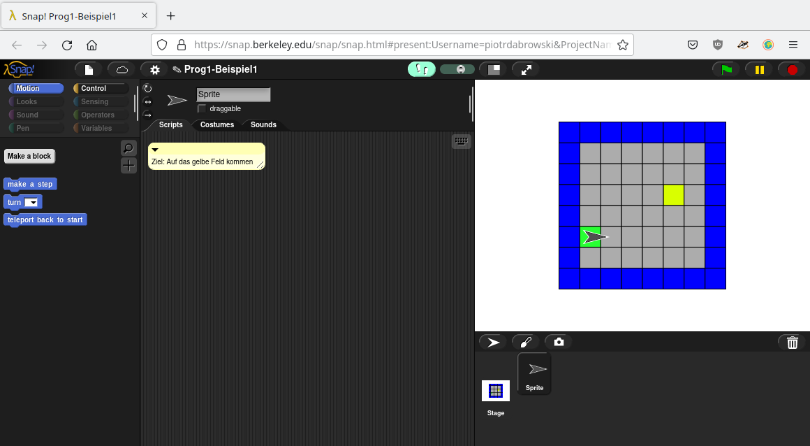
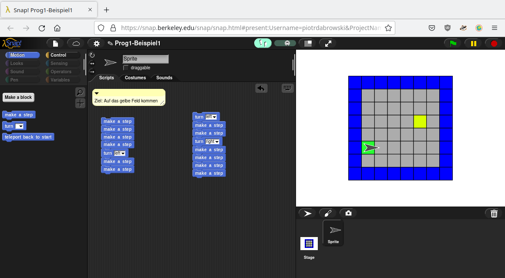
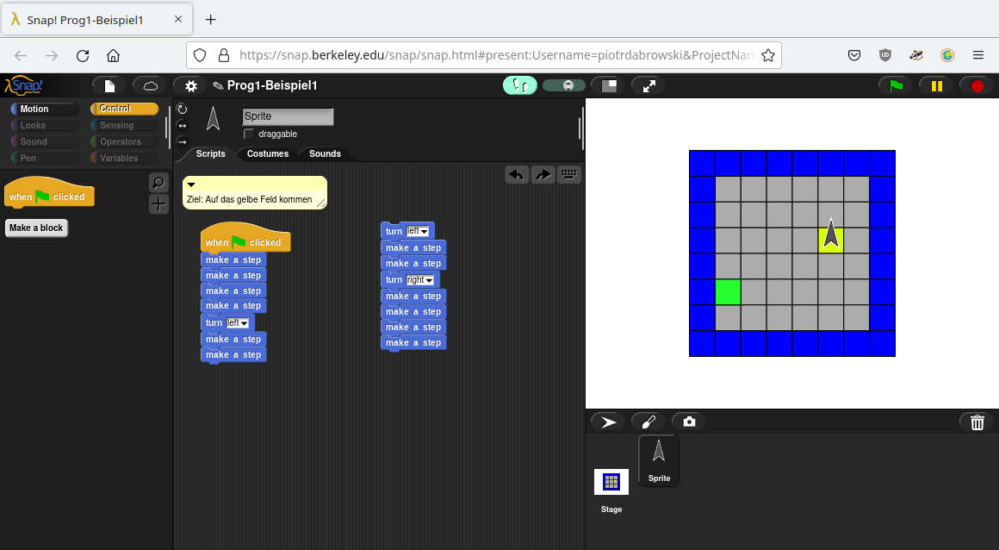
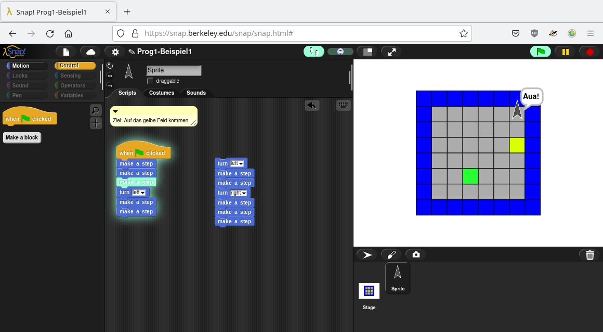
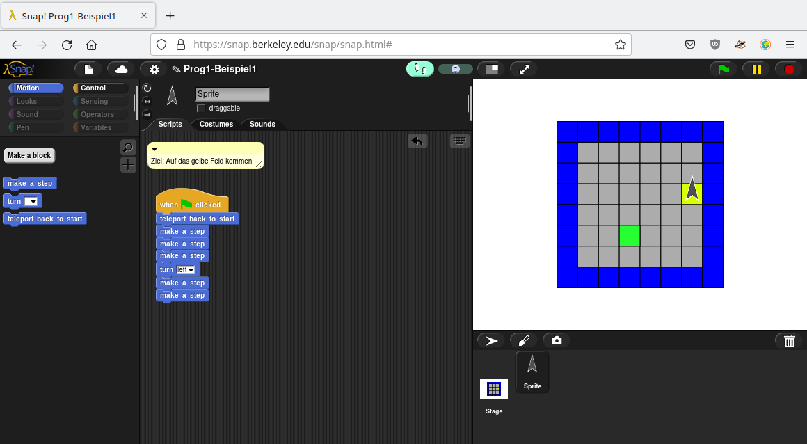

# Einführung in die Programmierung

Beginnen wir mit der guten Nachricht: Programmieren ist sehr einfach. Im Grunde
bedeutet es nur, idiotensicher aufzuschreiben, wie eine Aufgabe gelöst werden
soll. Diese Beschreibung wird (wenn sie bestimmten Kriterien genügt,
aber wenn Sie sie später als Programm aufschreiben, tut sie das automatisch) als Algorithmus bezeichnet. Je nachdem, welche Wörter man benutzt, um den
Algorithmus zu beschreiben, spricht man von der verwendeten Programmiersprache.
Ein extrem einfacher Algorithmus, der in der Informatik häufig zu
Demonstrationszwecken verwendet wird und nur aus einer Anweisung besteht,
lautet: `Gib den Text "Hello, World!" aus`. Man kann das unterschiedlich
aufschreiben:

 * Deutsch: `Gib den Text "Hello, World!" aus`
 * Englisch: `Say "Hello, world!"`
 * Applescript: `say "Hello, world!"`
 * Python: `print("Hello, world!")`
 * C++: `std::cout << "Hello, World!";`

Die letzten drei Beispiele - Applescript, Python und C++ - sind
Programmiersprachen. Die Programmiersprachen unterscheiden sich untereinander
sowie von der menschlichen Sprache in den Wörtern, die verwendet werden, und in
der Grammatik - die beschreibt, welche Wörter wie zu Sätzen kombiniert werden
können und in der Programmierung als Syntax bezeichnet wird. Genauso wenig, wie
Sie auf Deutsch sagen können: "Text gib "Hello, World!" den aus" können Sie in
Python `please print Hello, World!` schreiben. Der Hauptunterschied ist, dass
Muttersprachler vermutlich verstehen werden, was Sie mit einem falsch
formulierten Deutschen Satz meinen, Computer aber im Programm keine Abweichung
von der Syntax erlauben. Hier kommt der Punkt "idiotensichere Beschreibung"
in's Spiel. Wie Ted Nelson, einer der Pioniere der Informatik, sagte: "The good
news about computers is that they do what you tell them to do. The bad news is
that they do what you tell them to do" - egal wie sinnlos die Anweisung, egal
wie offensichtlich ein Fehler, der Computer wird exakt die Anweisungen in Ihrem
Programm befolgen. Das ist die Kunst der Programmierung: Eine Lösungsidee so
exakt Schritt für Schritt zu beschreiben, dass jemand, der nicht mitdenkt
sondern nur die Anweisungen befolgt - ein Computer also - sie durchführen kann. 

Entsprechend ist die Vorlesung aufgebaut: Zunächst beschäftigen wir uns damit,
wie man Problemlösungen strukturiert und exakt aufschreibt. Danach werden Sie
lernen, wie diese Problemlösungen in einer Programmiersprache aufgeschrieben
werden können und welche Probleme dabei auftauchen können.

## Ein paar einfache Algorithmen

In dem ersten Teil arbeiten wir mit der visuellen Programmiersprache [Snap!](https://snap.berkeley.edu/), in der Programme aus Blöcken zusammengesetzt werden. Die Logik bzw. der Aufbau eines Programms ist hierbei grundsätzlich so, wie in Java - nur, dass Sie sich hier noch nicht merken müssen, wie man jeden Befehl genau schreibt.

Schauen wir uns zunächst die grundlegende Funktionsweise von Snap! und einen ersten Algorithmus im [ersten Beispiel](https://snap.berkeley.edu/project?user=piotrdabrowski&project=Prog1-Beispiel1) an. Wenn Sie den Link öffnen und auf den "See code"-Button klicken, öffnet sich folgendes Fenster: 

Hier sehen Sie auf der rechten Seite die sogenannte Bühne. In den folgenden Aufgaben wird es immer darum gehen, den Pfeil über ein Spielfeld zu einem Ziel - in der Regel ein gelbes Feld - zu führen.

In der Mitte sehen Sie das Skriptfeld, in dem Sie Ihr Programm zusammenstellen. 

Auf der linken Seite sind die zur Verfügung stehenden Blöcke aufgelistet. Beachten Sie, dass die Blöcke in unterschiedliche Kategorien eingeteilt sind, und nur die Blöcke der jeweils oben links ausgewählten Kategorie - in diesem Beispiel "Motion" - sichtbar sind. 

Wichtig sind noch zwei weitere Bedienelemente: Durch Klick auf die grüne Fahne oben rechts starten Sie Ihr Programm. Und durch Klick auf die Fußspuren oben in der Mitte (im Screenshot hellblau hinterlegt) verlangsamen Sie die Ausführung des Programms, um die einzelnen Schritte besser nachvollziehen zu können. Die genaue Geschwindigkeit können Sie mit dem Schieberegler daneben einstellen.

Beginnen wir nun mit dem ersten Algorithmus, um den Pfeil von dem grünen auf das gelbe Feld zu führen. Dafür muss er 4 Schritte machen, sich dann nach links drehen, und dann weitere 2 Schritte machen (zumindest ist das eine der vielen möglichen Lösungen). Das lässt sich in Snap! durch drag&drop der entsprechenden Kontrollblöcke wie folgt abbilden:

Klicken Sie nun auf die grüne Fahne, passiert allerdings nichts. Denn es fehlt eine wichtige Information für das Programm: Und zwar, wo es beginnen soll. Im Moment stehen nur ein paar Anweisungen irgendwo im Raum, aber dem Computer ist nict klar, was er damit machen soll. Stellen Sie sich vor, Sie würden noch ein paar weitere Anweisungen danebenschreiben:

Welche dieser Reihen von Anweisungen soll ausgeführt werden, wenn Sie das Programm starten? Oder vielleicht beide? Falls beide, in welcher Reihenfolge? Um das klarzustellen, benötigt jedes Programm einen Einstiegspunkt (in der Regel als main-Funktion bezeichnet), der definiert, was der erste Befehl ist, der bei Programmstart ausgeführt wird. Danach werden die weiteren Befehle einfach der Reihe nach abgearbeitet.

In Snap! ist dieser Einstiegrpunkt in der Kategorie "Control" zu finden und heißt `When start clicked`. Fügen Sie diesen Block als ersten in der Befehlsreihe hinzu und klicken wieder auf die grüne Fahne, läuft der Pfeil entsprechend der Anweisungen auf das gelbe Feld:

Das würde an sich so funktionieren - aber leider nur ein Mal. Wenn Sie nun nochmal auf die grüne Fahne klicken, bekommen Sie folgendes Ergebnis:

Das liegt daran, dass der Pfeil sich nun zu Beginn des Programms nicht auf dem grünen Feld befand (wofür der Algorithmus eigentlich ausgelegt ist), sonder bereits auf dem gelben Feld stand. Stur die vorgegebenen Anweisungen befolgend ist er nun also nach zwei Schritten gegen die Wand gelaufen.

Dieses Problem hat jeder Algorithmus: Wenn die Rahmenbedingungen, für die er geschrieben wurde, nicht gegeben sind, dann funktioniert er unter Umständen nicht korrekt. Daher ist es wichtig, zu Beginn eines Programms zu überprüfen, ob die notwendigen Voraussetzungen gegeben sind - das kann beliebig einfach sein (bei einfachen Programmen, wie das Anfangsbeispiel zur Ausgabe von Hello World, muss man eigentlich nichts überprüfen) oder auch beliebig komplex (das Vorhandensein und die richtige Formatierung von Eingabedateien, die korrekte Funktionsweise von angeschlossenen externen Geräten etc.). In den hier vewendeten Snap!-Beispielen ist die Ausgangsbedingung grundsätzlich, dass der Pfeil auf dem richtigen Feld stehen und in die richtige Richtung zeigen muss. Dafür finden Sie unter "Motion" den Block `teleport back to start`. Fügen Sie diesen am Anfang des Programms hinzu, haben Sie eine zuverlässig funktionierende Lösung für diese erste Beispielaufgabe - Gratulation, Sie haben Ihren ersten Algorithmus erstellt!

