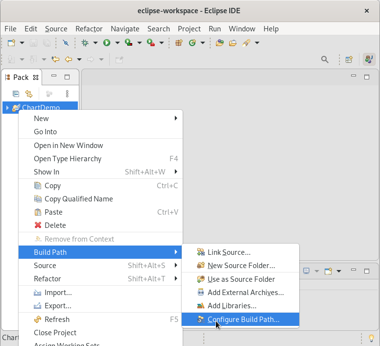
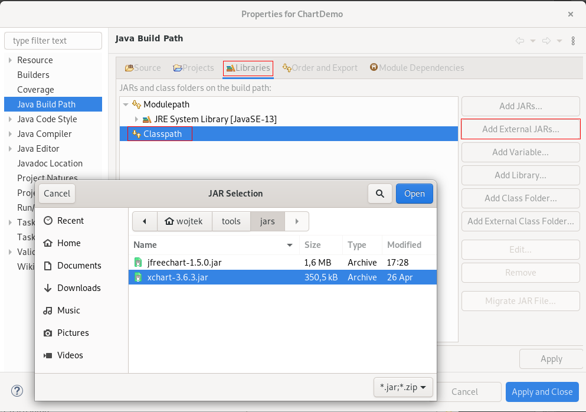
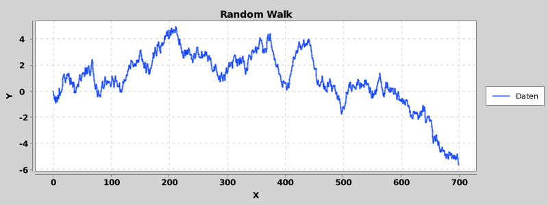

# Externe Libraries

Eins der berühmten Zitate von Isaac Newton ist seine Würdigung dessen, wie sehr wir von der Arbeit unserer Vorfahren profitieren: "Wenn ich weiter geblickt habe, so deshalb, weil ich auf den Schultern von Riesen stehe". Auch in der Softwareentwicklung sollte man sich, wo möglich, Schultern von Riesen suchen: Häufig ist ein Teil des Problems, das man versucht zu lösen, bereits von anderen gelöst worden. Auf diese fremde Lösung aufzubauen, anstatt das Rad neu zu erfinden, ist häufig der schnellste Weg zum Ziel. Um dies zu ermöglichen, werden häufig Sammlungen von Algorithmen in Form von sogenannten "Libraries" (englisch für "Bibliotheken") zur Verfügung gestellt. Die Verwendung solcher libraries am Beispiel von XChart, einer library zum Erstellen von Graphen, ist Gegenstand dieses Kapitels.

## Lizenzen

Vor der Verwendung fremder libraries ist eine rechtliche Formalie zu berücksichtigen: Die Lizenzbedingungen. Grob gesagt kann man Lizenzen in zwei Gruppen unterteilen: Kommerzielle Lizenzen und Open Source-Lizenzen.

Kommerzielle Lizenzen räumen in der Regel entgeltlich oder unentgeltlich beschränkte Nutzungsrechte an einer library ein. Meist müssen solche libraries bezahlt werden und für zahlende Kunden wird prioritärer Support angeboten, sie dürfen aber manchmal für nicht-kommerzielle Zwecke oder bis zum Erreichen bestimmter Umsatzgrenzen unentgeltlich genutzt werden.

Open Source-Lizenzen erlauben die kostenlose, uneingeschränkte Nutzung und weitere Verteilung einer library. Dabei wird in copyleft- und copyright-Lizenzen unterschieden. Copyleft-Lizenzen enthalten die Bedingung, dass jegliche abgeleiteten Werke wieder unter der gleichen Lizenz veröffentlicht werden müssen, während copyright-Lizenzen keinen solchen Passus enthalten.

Eine tiefergehende Auseinandersetzung mit den rechtlichen und gesellschaftlichen Implikationen der Verwendung von unterschiedlichen Lizenzen und unterschiedlich lizenziertem Code könnten mehrere eigene Vorlesungen füllen. An dieser Stelle sei nur darauf hingewiesen, dass man meist nichts falsch macht, wenn man unter einer open source-Lizenz veröffentlichte Libraries verwendet, ohne sie zu verändern (durch die reine Verwendung ohne Veränderung wird kein abgeleitetes Werk hergestellt und es muss nicht das komplette Programm unter die gleiche Lizenz gestellt werden, was auch copyleft-Lizenzen unproblematisch macht). Insbesondere in einem beruflichen Kontext sollte aber vor der Verwendung von fremdem Code eine rechtlich fundierte Meinung (auch bezüglich der Kompatibilität der Lizenzen unterschiedlicher externer Komponenten) eingeholt werden.

## Qualität externer Libraries

Zudem sollte bei der Verwendung fremden Codes auf die Qualität geachtet werden. Es ist zwar nicht realistisch, den Code komplett selber zu lesen und die Qualität einzuschätzen, aber die Beantwortung einiger einfacher Fragen kann eine grobe Vorstellung geben:

* Arbeitet nur eine Person an dem Code, oder ist eine größere Community an der Entwicklung beteiligt?
* Wird die library von mehreren erfolgreichen Projekten, vielleicht sogar von kommerziellen Produkten, verwendet?
* Gibt es einen öffentlich einsehbaren bug-tracker, und werden dort eingetragene Fehler schnell bearbeitet?
* Sind Sicherheitslücken im Zusammenhang mit der library bekannt (Siehe z.B. [http://cve.mitre.org/](http://cve.mitre.org/) und, wenn ja, wurden sie schnell im bug-tracker eingetragen und bearbeitet?

Die Einschätzung der Verwendbarkeit einer library hängt stark von den Anforderungen ab (etwas, was für ein kleines Hobby-Projekt die perfekte Lösung ist, kann für eine Produktemtwicklung ein absolutes no-go sein), und die o.g. Liste ist weder vollständig noch sind die Punkte absolute Ein- oder Ausschlusskriterien (es gibt beispielsweise sehr populäre libraries die eine miserable Code-Qualität besitzen und ein massives Sicherheitsrisiko für die sie verwendenden Projekte darstellen). Man sollte sich der Problematik aber bei der Auswahl einer library bewusst sein und sich im Zweifelsfall die Meinung von erfahreneren Personen einholen.

## Einbindung von Libraries in Eclipse

\begin{figure}
  \begin{subfigure}{0.43\textwidth}
    \includegraphics[width=\textwidth]{Bilder/jar_eclipse1.png}
    \caption{Öffnen der Build Path-Konfiguration}
    \label{jar:1_1}
  \end{subfigure}
  \begin{subfigure}{0.55\textwidth}
    \includegraphics[width=\textwidth]{Bilder/jar_eclipse2.png}
    \caption{Hinzufügen einer JAR-Datei}
    \label{jar:1_2}
  \end{subfigure}
  \caption{Hinzufügen einer JAR-Datei zu einem Eclipse-Projekt}
\end{figure}

Java-libraries werden in der Regel in Form von .jar-Dateien, die alle benötigten Klassen enthalten, bereitgestellt. Um eine library in einem Eclipse-Projekt zu verwenden, muss die entsprechende .jar-Datei dem "build path" (englisch für "Bauordner", eine Liste von Ordnern und .jar-Dateien, in denen alles zu finden ist, was zum Compilieren des Projektes nötig ist) hinzugefüg werden. Dafür wird der build path über Rechtsklick auf das Projekt->Build Path->Configure Build Path die Build-Path-Konfiguration geöffnet:



Dann kann im Reiter "Libraries" unter dem Punkt "Classpath" über den Button "Add External JARs..." eine .jar-Datei von der Festplatte ausgewählt und zum Projekt hinzugefügt werden:



## Verwendung von XChart

Beispielsweise wird hier die Verwendung von [XChart](https://knowm.org/open-source/xchart/) gezeigt. Diese open source-Bibliothek erlaubt es, auf einfache Weise Graphen aus Java heraus zu erstellen. Ein einfacher Überblick über die Funktionanlität und Verwendung kann üblicherweise durch Code-Beispiele auf der Projektseite gewonnen werden, so auch in diesem Fall unter [Example Code](https://knowm.org/open-source/xchart/xchart-example-code/). Eine genauere Dokumentation findet sich bei Java-libraries grundsätzlich unter dem Begriff "JavaDoc", so auch [in diesem Fall](https://knowm.org/javadocs/xchart/index.html).

Die Verwendung von XChart ist beispielhaft in dem folgenden Code dargestellt, der einen random walk anzeigt:

```java
import java.util.Random;
import org.knowm.xchart.BitmapEncoder;
import org.knowm.xchart.BitmapEncoder.BitmapFormat;
import org.knowm.xchart.XYChart;
import org.knowm.xchart.XYSeries;
import org.knowm.xchart.style.markers.SeriesMarkers;

public class Main {
  public static void main(String[] args) {
    double[] xdata = new double[700];
    double[] ydata = new double[700];
    Random r = new Random();
    for(int i=1; i<xdata.length; i++) {
      xdata[i] = i;
      ydata[i] = ydata[i-1] + (r.nextDouble()-0.5);
    }
    XYChart chart = new XYChart(800, 300);
    chart.setTitle("Random Walk");
    chart.setXAxisTitle("X");
    chart.setYAxisTitle("Y");
    XYSeries series = chart.addSeries("Daten", xdata, ydata);
    series.setMarker(SeriesMarkers.NONE);
    try {
      BitmapEncoder.saveBitmap(chart, "randomwalk.png", BitmapFormat.PNG);
    } catch(Exception e) {
      System.out.println("Fehler beim Speichern der Bilddatei.");
    }
  }
}
```

In Zeilen 10-16 werden zwei Arrays, die jeweils die x- und y-Koordinaten der darzustellenden Punkte enthalten, angelegt. Dafür wird die von Java standardmäßig mitgelieferte Klasse `Random` verwendet, deren Methode `nextDouble()` einen zufälligen Wert zwischen 0 und 1 liefert, um eine zufällige Reihe von Punkten zu erzeugen.

In Zeile 17 wird ein neues `XYChart`-Objekt erzeugt, welches einen Graph mit 800 Pixeln Breite und 300 Pixeln höhe darstellt. Zeilen 18-20 setzen den Titel und die Achenbeschriftungen. In Zeile 21 werden dann die x- und y-Koordinaten als neue Linie (bzw. Serie von Punkten im 2D-Raum, daher der Klassenname `XYSeries`) dem XYChart-Objekt hinzugefügt. Das zurückgelieferte XYSeries-Objekt kann, wie in Zeile 22 gezeigt ist, verwendet werden, um die Darstellung der Serie anzupassen - in diesem Fall wird die Darstellung von Punktmarkern abgeschaltet. Die hier zu sehende Verwendung eines statischen Attributs (`SeriesMarkers.NONE` greift auf den Wert des statischen Attributs NONE der Klasse SeriesMarkers zu) ist eine häufige Methode, um die Nutzung typischer Argumentwerte zu vereinfachen: Es braucht den Anwender nicht zu interessieren, was genau hinter `SeriesMarkers.NONE`, `SeriesMarkers.CIRCLE` oder `SeriesMarkers.DIAMOND` steht, aber auf den ersten Blick ist erkennbar, was diese Argumentwerte bewirken werden.

Zum Abschluss wird der von dem XYChart-Objekt `chart` repräsentierte Graph mit der statischen Methode `saveBitmap` der Klasse `BitmapEncoder` in eine PNG-Datei gespeichert - beachten Sie hier wieder die Verwendung des statischen Attributs `PNG`.

Das folgende Bild kommt dabei raus:


