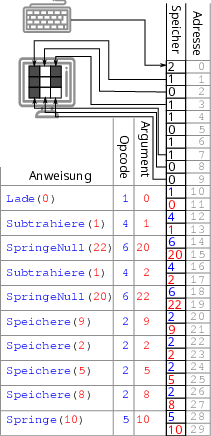
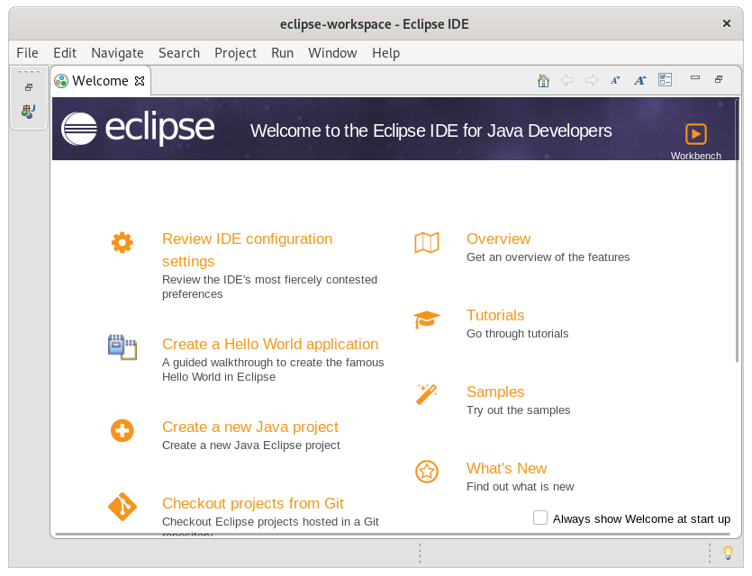
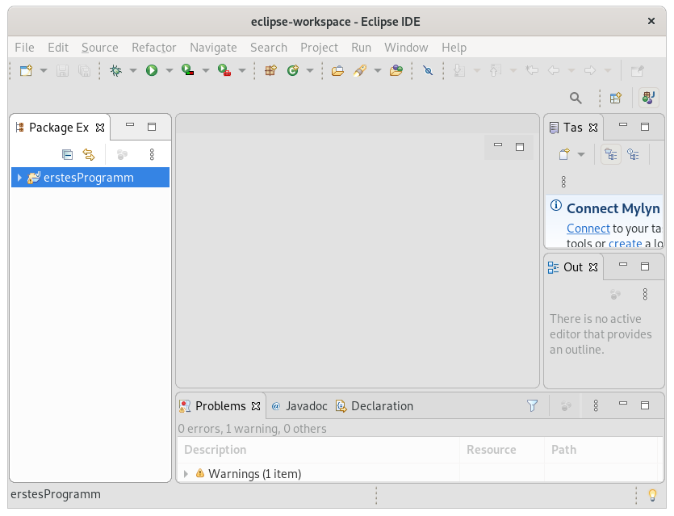
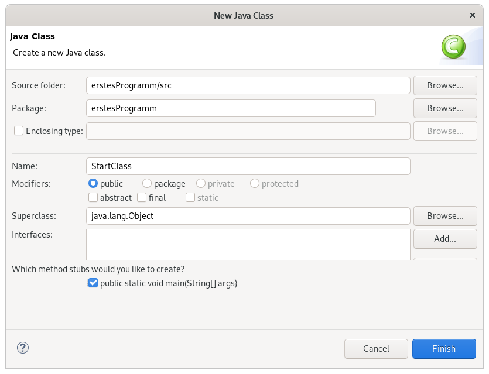
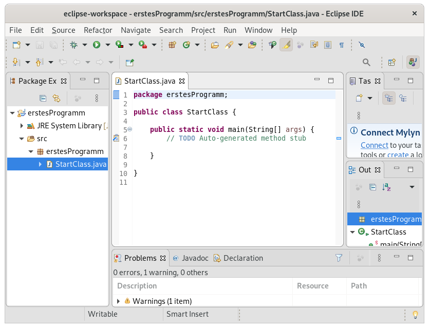
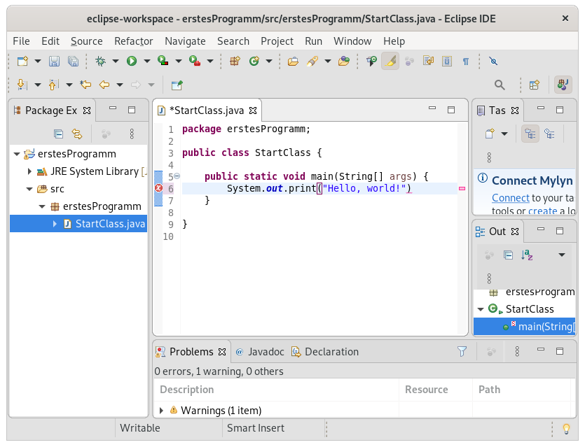
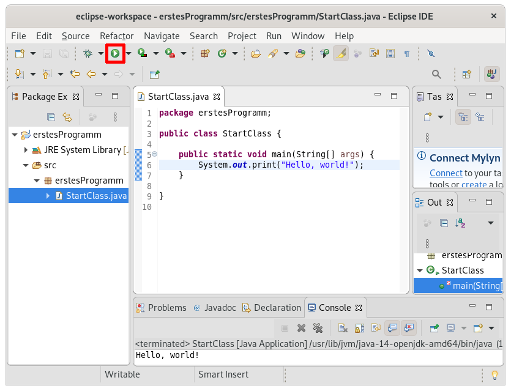
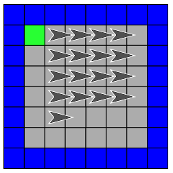

# Der Schritt zu Java

Wir haben nun gelernt, dem Pfeil in Snap! auf eine sehr systematische Art zu sagen, was er tun soll - auf eine Art, die derjenigen sehr ähnelt, auf die man einem Computer unter Verwendung der Programmiersprache Java sagt, was er tun soll. Wenden wir nun also unsere Kenntnisse an, um unsere ersten Java-Programme zu schreiben. Zunächst müssen wir aber eine wichtige Formalität klären, über die wir uns mit Snap! keine Gedanken gemacht haben: Wie teilen wir dem Computer mit, dass er das, was wir als Java-Programm aufschreiben, tun soll? Bei Snap! haben wir es uns einfach gemacht, indem wir gesagt haben, dass es die Blöcke versteht. Die Anweisungen, die ein Computer von sich aus versteht, sind aber viel zu simpel, als dass man damit einfach programmieren könnte.

## Was macht eigentlich ein Computer?

Auch, wenn wir heutzutage Computern unglaublich komplexe Aufgaben überlassen, sind sie im Kern sehr einfache Maschinen. Im Prinzip besteht der Computer aus einer Berechnungseinheit (Central Processing Unit, CPU), die Anweisungen abarbeitet und sich einen Wert merken kann (in einem als Register bezeichneten Bereich), und einem Speicher (Random Access Memory, RAM), in dem Daten stehen. Wenn ein Programm ausgeführt wird, wird dazu der CPU mitgeteilt, wo im RAM das Programm beginnt - also welche Daten sie als Anweisungen interpretieren soll. Die CPU nimmt dann die Anweisung, die unter der angegebenen Speicheradresse liegt, führt sie aus, geht dann zur nächsthöheren Speicheradresse, führt diese aus, und so weiter. Dabei versteht sie folgende Anweisungen:

1. **Lade(«Speicheradresse»)**: Merke dir im Register den Wert, der im RAM unter der Adresse «Speicheradresse» steht.
2. **Speichere(«Speicheradresse»)**: Speichere den Wert, der im Register steht, im RAM unter der Adresse «Speicheradresse».
3. **Addiere(«Wert»)**: : Addiere die Zahl «Wert» auf das, was im Register steht, und merke dir das Ergebnis wieder im Register.
4. **Subtrahiere(«Wert»)**: Ziehe die Zahl «Wert» von dem ab, was im Register steht, und merke dir das Ergebnis wieder im Register.
5. **Springe(«Speicheradresse»)**: Springe zur Adresse «Speicheradresse» (und führe entsprechend als nächstes die Anweisung aus, die dort steht).
6. **SpringeNull(«Speicheradresse»)**: Wenn der aktuell im Register gespeicherte Wert exakt gleich 0 ist, dann springe zur Adresse «Speicheradresse» (und führe entsprechend als nächstes die Anweisung aus, die dort steht).

Aktuelle CPUs haben mehrere Register und unterstützten deutlich mehr Anweisungen (eine Intel Core i7-CPU versteht beispielsweise [knapp 350 unterschiedliche Anweisungen](https://www.intel.com/content/dam/www/public/us/en/documents/manuals/64-ia-32-architectures-software-developer-instruction-set-reference-manual-325383.pdf)), diese sind aber im Endeffekt nur bequemere zusammengesetzte Varianten der hier angegebenen Anweisungen: Computer arbeiten grundlegend auf der Ebene von Zahlen, die miteinander verrechnet werden, und basierend auf dem Ergebnis wird das Programm vor- oder zurückgespult.

Wie kann mit solchen simplen Anweisungen überhaupt ein sinnvolles Computerprogramm entstehen[^1]? Nehmen wir ein sehr einfaches Beispiel: Ein Programm, das die Taste, die gerade auf der Tastatur gedrückt wird, auf dem Bildschirm anzeigt. Und der Einfachkeit halber hat unser Computer nur eine sehr kleine Tastatur - mit nur zwei Buchstaben, I und L - und einen sehr kleinen Bildschirm - mit nur 3x3 Pixeln.

Die Tastatur ist dabei so angeschlossen, dass sie den Inhalt des Speichers an der Adresse 0 kontrolliert: Wird die Taste I gedrückt, steht an der Speicheradresse 0 der Wert 1, und wird die Taste L gedrückt, steht dort der Wert ``2''[^2].

Der Bildschirm ist auch direkt an den Speicher angeschlossen: Die Speicheradressen 1-3 kontrollieren die Pixel der ersten Reihe, die Speicheradressen 4-6 die mittlere Pixelreihe, und die Speicheradressen 7-9 die letzte. Steht an einer dieser Speicheradressen eine 1, wird das entsprechende Pixel schwarz dargestellt, und sonst weiß[^3]. Wir nehmen an, dass zunächst dieser Speicherbereich immer mit 1 gefüllt ist (der Bildschirm ist schwarz). 

Ab der Speicheradresse 10 beginnt das Programm. Allerdings stehen im Speicher nur Zahlen, keine Texte. Entsprechend sind den einzelnen Anweisungen Werte zugeordnet, die sogenannten Opcodes (Operation Codes). Eine vollständige Anweisung besteht aus zwei Zahlen: Dem Opcode gefolgt von dem Argument. Der Einfachkeit halber entsprechen bei uns die Opcodes den Nummern der Anweisungen in der Aufzählung oben. Die zwei Werte ``1 0'' würden also heißen: Opcode 1 mit dem Argument 0, also ``Lade(0)'', also ``Merke dir im Register den Wert, der in der Speicheradresse 0 steht'' (wir erinnern uns: Die Speicheradresse, an die die Tastatur schreibt).


Einen Algorithmus, der die gedrückte Taste aus der Speicheradresse 0 ausliest und dann, je nachdem ob es ein I (Wert 1 unter der Speicheradresse 0 eingetragen) oder ein L (Wert 2 unter der Speicheradresse 0 eingetragen) ist, entweder die Werte unter den Speicheradressen 2, 5, und 8 auf 0 setzt (damit werden die drei Pixel in der mittleren Reihe weiß - es wird also ein I auf dem Bildschirm angezeigt), oder zusätzlich den Wert unter der Speicheradresse 9 auf 0 setzt (damit wird auch das rechte untere Pixel weiß, es wird also ein L auf dem Bildschirm angezeigt), sehen Sie hier:

```
In einer Endlosschleife wiederholen {
  Wenn 1 an Speicheradresse 0 steht {
    Schreibe Werte, die "I" darstellen, in die Speicheradressen 1-9
  }
  Wenn 2 an Speicheradresse 0 steht {
    Schreibe Werte, die "L" darstellen, in die Speicheradressen 1-9
  }
}
```

Im Computer wäre das mit eingangs beschriebenen Anweisungen umgesetzt: 



Auf der linken Seite steht die Abfolge der Anweisungen, daneben die Übersetzung in Opcodes (Zuordnung Anweisung -> Opcode siehe Nummerierung der Anweisungen in der Liste am Anfang der Seite), und daneben der resultierende Speicherhinhalt. Unter den Speicheradressen 0-9 sind als Beispiel die Werte eingetragen, nachdem die Taste L gedrückt wurde (die Tastatur also den Wert 2 an die Speicheradresse 0 geschrieben hat) und das Programm durchgelaufen ist (die Speicheradressen 1-9, die die Pixel auf dem Bildschirm kontrollieren, also so gesetzt hat, dass ein weißes ``L``auf schwarzem Hintergrund gezeichnet wurde). Versuchen Sie, im Kopf die Anweisungenfür den dargestellten Fall, dass ein L gedrückt wurde, durchzuspielen, um nachzuvollziehen, dass dann die richtigen Speicherwerte gesetzt werden, um auch ein L anzuzeigen. Beachten Sie dabei, dass ``Speichere«Speicheradresse»`` den Wert aus dem Register unter der angegebenen Speicheradresse speichert, und zu dem Zeitpunkt, zu dem die Speichern-Anweisungen ausgeführt werden, im Register auf jeden Fall 0 steht (das Programm kommt durch ein ``SpringeNull`` zu den ``Speichere``-Anweisungen, und ``SpringeNull`` springt zu einer Speicheradresse, wenn im Register 0 steht). Versuchen Sie dann auch, nachzuvollziehen, wie diese Anweisungen in Opcode-Argument-Zahlenpaare übersetzt werden und dass der Computer dann auf Basis der Werte, die in den Speicheradressen 10-29 stehen, tatsächlich das Programm ausführen kann.

## Wie kann man bequem mit einem Computer kommunizieren?

Ein Computer tut also nichts anderes, als die Zahlen, die hintereinander im Speicher stehen, als Anweisungen und ihre Argumente zu interpretieren, und basierend auf diesen Anweisungen und Argumenten wiederum Zahlen miteinander zu verrechnen. Ursprünglich wurden Computer auch genau so programmiert: Es wurden Opcodes und Argumente hintereinander als Zahlen aufgeschrieben - das wird dann als Maschinencode bezeichnet. Ein erster Vereinfachungsschritt war die Einführung von Assemblersprachen: In einer Assemblersprache werden die Anweisungen, die die CPU versteht, als menschenlesbarer Text geschrieben, und dann von einem als Assembler bezeichneten Programm eins zu eins in Maschinencode übersetzt (die Anweisungen im vorangegangenen Beispiel auf der linken Seite sind also ein in Assemblersprache geschriebenes Programm, welches von einem Assembler in den daneben dargestellten, nur noch aus Zahlen bestehenden, Maschinencode übersetzt wird).

## Höhere Programmiersprachen allgemein

Auf diese Art Programme zu schreiben ist allerdings, wenn auch nicht unmöglich, so doch sehr anstrengend und fehleranfällig. Um das Leben der Programmierer einfacher zu machen, wurden also höhere Programmiersprachen entwickelt. Diese erlauben es, mit komplexeren und für Menschen einfacher zu verstehenden Anweisungen, Programme zu schreiben - so, wie wir die Algorithmen für Snap! geschrieben haben. Diese Anweisungen werden dann von einem als Compiler bezeichneten Programm in Maschinencode übersetzt. Dieser Maschinencode ist dann keine direkte Übersetzung der Anweisungen im Programm in Maschinencode mehr: Jede Anweisung aus dem ursprünglichen Programm kann tausende Opcodes im Maschinencode umfassen[^4]. Der Vorteil ist, dass man sich als Programmierer mit dem Maschinencode nicht mehr auseinandersetzen muss: Man schreibt sein Programm mit den Anweisungen, die in der verwendeten Programmiersprache definiert sind, und vertraut darauf, dass der Compiler eine korrekte Übersetzung für den Computer findet[^5].

So sehr die Verwendung von höheren Programmiersprachen das Leben erleichtert, so sehr muss man immer in Erinnerung behalten, dass auch ein Compiler am Ende nur eine Anreihung von ganz einfachen Befehlen ist. Er kann also nicht mitdenken, er kann nicht verstehen, was mit dem Programmcode, den er in Maschinencode übersetzt, gemeint ist - er befolgt nur vorgegebene Regeln zum Übersetzen. Hier also die Begründung für die im vorangegangenen Kapitel immer wieder erwähnte Notwendigkeit, sich sklavisch an vorgegebene Schreibregeln zu halten und davon auszugehen, dass der Computer nicht mitdenkt: Er kann es gar nicht, er kann nur Zahlen zusammenrechnen.

### Java 

Java ist eine höhere Programmiersprache, die noch eine Abstraktionsebene mehr einführt: Anstatt den Programmcode direkt in Maschinencode zu übersetzen, übersetzt der Java-Compiler das Programm zunächst in Bytecode. Dieser ist im Endeffekt genau so aufgebaut, wie Maschinencode. Es gibt aber einen ausschlaggebenden Unterschied: Maschinencode wird direkt von der CPU eines Computers ausgeführt. Unterschiedliche CPUs von unterschiedlichen Herstellern nutzen dabei unterschiedliche Befehlssätze: Der gleichen Anweisung kann auf unterschiedlichen CPUs ein anderer Opcode zugewiesen sein (beispielsweise könnte der Opcode 1 auf einer Intel-CPU ``Subtrahiere`` heißen, während auf einer AMD-CPU der gleiche Opcode 1 ``Addiere`` bedeutet und ``Subtrahiere`` den Opcode 7 haben könnte), und es gibt Anweisungen, die nicht alle CPUs beherrschen[^6]. Das bedeutet, dass der gleiche Maschinencode nicht auf sehr unterschiedlichen CPUs verwendet werden kann. Java umgeht das, indem der vom Compiler generierte Bytecode nicht direkt auf der CPU ausgeführt wird. Stattdessen gibt es für unterschiedliche Systeme und unterschiedliche CPUs jeweils eine eigene Java Virtual Machine (JVM), die dann, wenn das Programm ausgeführt wird, direkt in Echtzeit den Bytecode in den für die jeweilige CPU richtigen Maschinencode übersetzt.

### IDEs und Eclipse

All dies ist zum Verständnis dessen, was mit Ihrem Programm - wenn Sie es denn geschrieben haben - eigentlich im Computer passiert, sehr nützlich. Es hilft Ihnen aber nicht dabei, tatsächlich endlich Ihr erstes Programm zu schreiben. Die einfachste Methode dafür ist das Verwenden einer Integrated Development Environment (IDE). Eine IDE für eine Programmiersprache enthält Werkzeuge, die das Programmieren erleichtern, dabei insbesondere:

* Einen Editor, der die Programmiersprache kennt und eine hilfreiche Visualisierung ("Syntax highlighting" - bestimmte Begriffe, wie z.B. Ausdrücke, werden farblich zur besseren Lesbarkeit hervorgehoben) sowie automatisches Einrücken anbietet
* Hilfreiche Hinweise zu offensichtlichen Fehlern im Code, die direkt im Editor angezeigt werden
* Einen direkt integrierten Compiler, so dass Sie zum Compilieren und Ausführen des Programms nur eine ``Play''-Button drücken müssen


Eine beliebte IDE für Java ist Eclipse. Es ist zwar weder überhaupt die Verwendung einer IDE, noch die Verwendung von Eclipse als IDE (es gibt mehrere Alternativen), für das Nachvollziehen der folgenden Beispiele notwendig, aber der Einheitlichkeit halber werde ich konkrete Anleitungen auf Eclipse beziehen. Wenn Sie Eclipse verwenden wollen, laden Sie es also von [https://www.eclipse.org](https://www.eclipse.org) runter und installieren Sie es auf Ihrem Computer. Beim Start werden Sie zunächst nach dem Workspace-Verzeichnis gefragt - das ist der Ort auf Ihrem Computer, an dem Ihre in Eclipse geschriebenen Programme gespeichert werden. Wählen Sie irgendwas aus oder akzeptieren Sie den Standardwert und bestätigen Sie. Sie werden von dem Eclipse-Startbildschirm begrüßt:



Erstellen Sie mittels ``File->New->Java Project`` ein neues Java-Projekt. Es werden zunächst einige Details abgefragt. Tragen Sie nur einen Namen für das Projekt im ersten Textfeld ein und verändern Sie keinen anderen Werte. Wenn Sie dann auf ``Finish`` klicken, erscheint zunächst noch eine Abfrage, ob Sie eine module-info.java erstellen wollen - verneinen Sie dies und Ihr Projekt wird erstellt. Zunächst kommen Sie dann wieder zum Startbildschirm, wenn Sie dann aber durch Klick auf das Kreuz rechts oben den ``Welcome``-Tab schließen, erscheint Ihr Projekt:



An diesem Punkt haben Sie Eclipse mitgeteilt, dass Sie ein Programm in Java schreiben wollen. Dieses Programm kann aber aus beliebig vielen Dateien, in denen Teile des Programms stehen, aufgeteilt sein. Um tatsächlich Java-Code schreiben zu können, müssen Sie zunächst eine erste solche Datei anlegen. Tun Sie das mittels ``File->New->Class``[^7]. Es werden wieder einige Dinge abgefragt. Geben Sie unter ``Name`` einen Namen (z.B. ``StartClass``) ein und setzen Sie ganz unten das Häkchen bei ``public static void main(String[] args)``:



Eclipse legt für Sie nun eine Datei an der richtigen Stelle[^8] im Projekt an:



Nun wird es an der Zeit, endlich dem Computer eine Anweisung in Java zu geben. Ersetzen Sie die Zeile ``// TODO Auto-generated method stub`` durch die Zeile ``System.out.print("Hello, world!");`` (keine Leerzeichen bei den Punkten, achten Sie auf das Semikolon am Ende). Die Funktion ``System.out.print(«Text»)`` bedeutet: ``Gib auf dem Bildschirm den Text «Text» aus``. Sollten Sie einen Fehler gemacht haben, z.B. das Semikolon vergessen, wird Eclipse Sie direkt durch eine rote Unterstreichung darauf hinweisen:



Wenn Sie keine roten Markierungen sehen, klicken Sie auf den grünen Play-Button oben rechts auf dem Fenster (in dem nächsten Bild rot markiert) oder drücken Sie die Tastenkombination Strg-F11. Nun ruft Eclipse den Java-Compiler auf, der das Programm in Bytecode übersetzt, und übergibt diesen Bytecode dann der JVM, die ihm ausführt - und Sie sehen unten im Eclipse-Fenster, dass das Programm ``Hello, world!`` ausgegeben hat:



Sie wissen nun, wie man ein Java-Programm schreibt, compiliert und ausführt. Nun ist es an der Zeit, dieses Wissen mit dem Verständnis von Algorithmen-Entwicklung, welches Sie in Snap! ausprobiert haben, zu kombinieren, um dem Computer komplexere Aufgaben zu geben.

## Ein einfaches Java-Programm: Muster ausgeben

Nehmen wir als erstes Beispiel die Musteraufgabe aus Snap!:



Anstatt aber Pfeile zu malen, geben wir Zeichen aus. Wir wissen schon, dass wir statt ``stamp`` in Java die Funktion ``System.out.print(«Text»)`` verwenden können. Die Anweisung ``make a step`` benötigen wir nicht - die Funktion ``System.out.print(«Text»)`` geht automatisch um die Anzahl der ausgegebenen Zeichen weiter, so dass zwei ausgegebene Texte nicht übereinander liegen. Wir benötigen dann noch etwas, um am Ende einer Zeile nach unten und wieder zum Beginn der Zeile zurückzugehen. Glücklicherweise geht das vergleichsweise einfach: Der Text ``\n`` wird von Java als ``newline``, was soviel bedeutet wie ``beginne eine neue Zeile für die Textausgabe``, interpretiert. Man kann also einfach ``System.out.print("\n");`` schreiben, um danach in einer neuen Zeile weiterzuschreiben. Probieren Sie es aus - ersetzen Sie die Zeile ``System.out.print("Hello, world!");`` in Ihrem Programm durch den folgenden Code aus Abbildung:

```java
System.out.print("*");
System.out.print("*");
System.out.print("*");
System.out.print("\n");
System.out.print("+");
System.out.print("+");
System.out.print("+");
```

Alternativ können Sie das auch mit nur einer Zeile Code probieren:

```java
System.out.print("***\n+++")
```

Vielleicht fragen Sie sich an diesem Zeitpunkt, wieso Sie nicht einfach nur diesen Code in Ihr Programm schreiben können, sondern die Zeilen drumherum auch behalten müssen. Die Antwort darauf ist leider zunächst: Nehmen Sie da bitte vorerst einfach so hin. In den nächsten Kapiteln werden die einzelnen Begriffe und Zeilen zunehmend klar, aber dafür ist noch einiges an Grundlagen notwendig, die sich nicht mit einem Nebensatz abhandeln lassen. Eine sehr grobe Zusammenfassung der Bedeutung der einzelnen Zeilen ist aber:

* ``package erstesProgramm;``: Java-Programme umfassen häufig mehrere zig tausend Zeilen, größere Projekte können auch Millionen von Zeilen Java-Code beinhalten. Um einen groben Überblick zu bewahren, was wo steht, werden die einzelnen Programmteile danach, was sie tun, in hierarchisch angeordnete Pakete sortiert. Sie sehen diese Struktur auch in Eclipse, nachdem Sie die erste Java-Datei angelegt haben, auf der rechten Seite: Unter Ihrem Projekt hängt der Ordner ``src``, in dem sich der Programmcode befindet. Dieser enthält das Paket ``erstesProgramm`` (falls Sie dem Beispiel gefolgt sind, sonst halt Ihren Namen), in welchem Ihre Datei ``StartClass.java`` liegt.
* ``public class StartClass``: Eine weitere logische Unterteilung des Programmcodes findet in sogenannten Klassen statt, die jeweils konzeptionell zusammengehörende Funktionen und Variablen[^9] an einem Ort sammeln. In Java wird im Normalfall jede Klasse in eine eigene Datei geschrieben, deren Name dem Namen der Klasse entspricht. In der Datei StartClass.java steht also die Klasse StartClass. Der Begriff ``public`` beschreibt, auf welche Art Funktionen aus anderen Klassen auf diese Klasse zugreifen können.
* ``public static void main(String[] args)``: Das ist die Java-Art, eine Funktion zu definieren: ``public static void`` beschreibt ein paar allgemeine Eigenschaften der Funktion, auf die wir später im Detail eingehen werden. ``main`` ist der Name der Funktion, ``args`` ist ein Argument und ``String[]`` beschreibt, was in dem Argument stehen kann (in diesem Fall eine Liste von Texten - auch damit befassen wir uns später im Detail). Wichtig ist, dass Sie Ihren Code in genau diese Funktion schreiben: Wenn die JVM Bytecode ausführen soll, schaut sie nach einer Funktion, die exakt diese Beschreibung hat, und fängt die Ausführung des Programms mit dieser Funktion an (diese Funktion ist also sozusagen das ``When Start clicked`` aus Snap!). 

Natürlich beherrscht Java auch Kontrollstrukturen, wie Sie sie aus Snap! kennen:

* ``Repeat until``:  wird in Java als ``while(«Bedingung»)`` geschrieben
* Oft wird auch die ``for``-Schleife verwendet, die eine Kurzschreibweise für eine ``while``-Schleife mit Zählvariable darstellt: ``for(«Datentyp» «Variable»=«Startwert»; «Bedingung»; «Variable» «Operation»)``

Beispielsweise könnte man das 4x4-Muster aus der Snap!-Aufgabe in Java mit einer ``while``-Schleife lösen:

```java
int rows=0;
while(rows<4) {
  System.out.print("****\n")
  rows=rows+1;
}
```

oder auch äquivalent mit einer ``for``-Schleife, die das Anlegen der Variable ``rows`` aus der ersten Zeile und ihr Hochzählen aus der vorletzten Zeile direkt mit in der Schleifendefinition abhandelt:

```java
for(int rows=0; rows<4; rows=rows+1) {
  System.out.print("****\n")
}
```

Selbstverständlich gibt es in Java auch ein ``if``. Probieren Sie aus, was der folgende Code macht, und versuchen Sie, ihn nachzuvollziehen - als ``while``-Variante:

```java
int rows=0;
while(rows<5) {
  if(rows == 2) {
    System.out.print(".....\n")
  }
  if(rows != 2) {
    System.out.print("*****\n")
  }
  rows=rows+1;
}
```

Und als ``for``-Variante:

```java
for(int rows=0; rows<5; rows=rows+1) {
  if(rows == 2) {
    System.out.print(".....\n")
  }
  if(rows != 2) {
    System.out.print("*****\n")
  }
}
```


[^1]: Keine Sorge, Sie müssen nicht in der Lage sein, das selber zu machen. Aber es zu verstehen ist Voraussetzung, um später zu verstehen, warum bestimmte Dinge in Java auf eine bestimmte Art gelöst sind.

[^2]: Das war in frühen Computern tatsächlich so gelöst. Heutzutage sind ein paar Abstraktionsebenen dazwischen, um z.B. Sicherheitsprobleme zu umgehen, aber im Endeffekt funktioniert es immer noch genauso.

[^3]: Auch hier gilt: Früher funktionierte das exakt so, heutzutage sind ein paar Abstraktiosebenen dazwischen, am Grundkonzept hat sich aber nichts geändert.

[^4]: Diese Übersetzung ist auch nicht eindeutig - es gibt viele Möglichkeiten, ein Programm in Maschinencode zu übersetzen. Compilerbau ist dementsprechend ein sehr komplexes und immer noch hochaktuelles Forschungs- und Entwicklungsgebiet.

[^5]: Es kann dabei tatsächlich zu Fehlern kommen, aber bei reifen Programmiersprachen wie Java ist die Wahrscheinlichkeit, dass Sie einen Compilerfehler finden, verschwindend gering - bei keiner der Aufgaben, die Sie im Rahmen dieses Moduls (und mit an Sicherheit grenzender Wahrscheinlichkeitn auch im Rahmen Ihres gesamten Studiums) bearbeiten werden, werden Sie einen Fehler in der Funktionsweise des Compilers aufdecken.

[^6]: Vielleicht haben Sie beispielsweise in der Beschreibung Ihres Computers unter ``CPU'' Abkürzungen wie ``SSE4.1'', ``AVX2'' o.Ä. gesehen - das sind Bezeichnungen für standardisierte Sammlungen von Anweisungen, die die CPU verstehen kann, um bestimmte Berechnungen effizienter durchfürhren zu können.

[^7]: Warum hier ``Class`` statt ``Java file`` o.Ä. steht, sehen wir erst deutlich später - nehmen Sie das erstmal einfach als sprachspezifisches Vokabular hin.

[^8]: Sprich: An einer Stelle, an der der Compiler die Datei nachher finden und zuordnen können wird.

[^9]: Wenn Funktionen und Variablen zu einer Klasse gehören, werden sie eigentlich als Methoden und Attribute bezeichnet, aber auf diese Feinheiten gehen wir erst deutlich später ein.