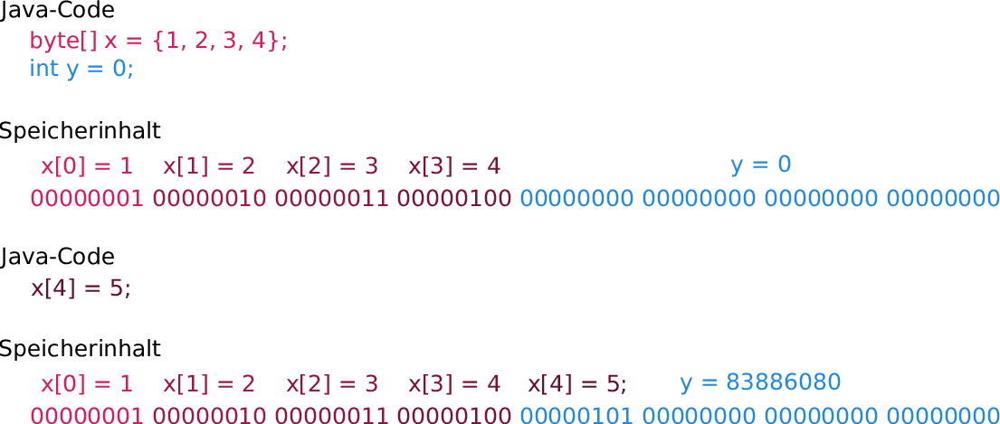

# Arrays

Mit dem Wissen über Kontrollstrukturen, Methoden und Variablen, welches Sie jetzt haben, können Sie schon eine Menge Berechnungen anstellen. Nehmen wir ein Beispiel: Sie haben diverse Daten zu mit SARS-CoV-2 infizierten Person. Sie könnten nun, wenn Sie die entsprechenden Formeln kennen, interessante Dinge berechnen wie die Wahrscheinlichkeit eines schweren Verlaufes oder wie lange die Person voraussichtlich ansteckend sein wird. Das sind sehr nützliche Dinge, die durchaus auch Funktionalitäten einer Software z.B. für Ärzte sein könnten. Allerdings würde eine solche Software kaum immer nur mit den Daten einer Person arbeiten - es wäre nützlicher, wenn Daten zu einer ganzen Liste an infizierten Personen gleichzeitig ausgewertet (und die Personen dann auch z.B. nach Risiko sortiert) werden könnten.

Um solche Berechnungen an einer ganzen Reihe gleichartiger Daten durchzuführen, müssen diese Daten entsprechend im Arbeitsspeicher vorliegen. Dafür werden Arrays verwendet. Eine Variable von einem bestimmten Datentyp besagt, dass an einer Stelle im Arbeitsspeicher ein Wert gespeichert ist, der entsprechend des definierten Datentyps interpretiert werden soll. Ist diese Variable ein Array von diesem Datentyp, heißt es, dass an dieser Stelle im Arbeitsspeicher nicht nur ein solcher Wert gespeichert ist, sondern mehrere Werte hintereinander. Die Anzahl der in einem Array auf diese Art hintereinander gespeicherten Werte wird als Länge des Arrays bezeichnet.

## Definition von und Zugriff auf Arrays

Dass es sich bei einer Variable um ein Array handelt, wird mit eckigen Klammern hinter dem Datentyp gekennzeichnet: `int x` ist eine Variable vom Datentyp int, in der ein int-Wert steht. `int[] x` ist ein Array vom Datentyp int, in dem mehrere int-Werte hintereinander stehen. Die Werte, die in einem Array stehen sollen, werden in geschweiften Klammern angegeben: `int x = 5;` definiert x als neuen int mit dem Wert 5, `int[] x = {1, 5, 9};` definiert x als Array von int-Werten, in dem hintereinander die drei Werte 1, 5 und 9 stehen. Alternativ kann nur die Länge des Arrays angegeben werden, es wird dann automatisch mit Nullen befüllt. Die Syntax dafür ist ein wenig anders: `int[] x = new int[10];` legt ein neues int-Array der Länge 10, befüllt mit Nullen, an. 

Über eckige Klammern wird auch auf die einzelnen Werte im Array zugegriffen: Ist x ein Array, können Sie z.B. den dritten Wert durch `System.out.println(x[2]);` ausgeben oder durch `x[2] = 7;` neu setzen (hier ist `x[2]` der dritte, nicht der zweite Wert im Array x - Sie erinnern sich vielleicht, in der Informatik fängt man bei 0 an zu zählen, also ist x[0] der erste Wert). Dabei wird die Position des Arrays, auf die Sie zugreifen, als der Index bezeichnet, in dem Beispiel `x[2]` greifen Sie also auf den Index 2 des Arrays x zu.

Wichtig ist dabei zu beachten, dass Array-Längen fest sind: Die darin gespeicherten Werte können zwar verändert werden, aber nicht die Anzahl der Werte. Das liegt daran, dass zur effizienten Nutzung des Arbeitsspeichers alle Variablen nach Möglichkeit im Speicher hintereinander abgelegt werden. Definieren Sie in einer Funktion zuerst ein byte-Array der Länge 4 (`byte[] x = {1, 2, 3, 4}`) und dann einen int (`int y = 0`), werden im Speicher 8 byte hintereinander belegt: Zuerst die 4 byte für das Byte-Array und dahinter die 4 Byte für den int. Der Speicherinhalt dazu ist hier in der oberen Hälfte gezeigt:



Würden Sie jetzt das Array erweitern, indem Sie den 5. Wert setzen (z.B. `x[4] = 5;`), würden Sie dadurch das 5. byte des Arrays auf den Wert 5 setzen - was grundsätzlich gehen würde. Wenn Sie danach aber wieder auf den Wert von y zugreifen, würden Sie feststellen, dass y plötzlich nicht mehr 0 ist, sondern 83886080: Da x und y im Speicher hintereinander liegen, wäre das 5. byte von x gleichzeitig das 1. byte von y, und Sie hätten durch das Verändern des 5. byte von x somit auch den Wert von y mit verändert (dargestellt im unteren Teil der Abbildung eben).

Aus diesem Grund lässt Java eine solche Veränderung nicht zu. Wenn Sie ein Programm ausführen, welches zu irgendeinem Zeitpunkt versucht, auf einen Index eines Arrays zuzugreifen, welcher über den für das Array vorhergesehenen Speicherplatz hinaus zeigt, wird das Programm abgebrochen und der Fehler `
java.lang.ArrayIndexOutOfBoundsException` angezeigt - der übersetzt genau das Problem beschreibt (`Array index out of bounds` hieße übersetzt `Zeiger im Array außerhalb des zulässigen Wertebereichs`).

Um solche Fehler zu vermeiden, sollte man bei Zugriffen auf Arrays immer überprüfen, ob der Index, den man versucht zu verwenden, tatsächlich im Array ist. Dafür kann von einem Array über das Attribut `length` seine Länge abgefragt werden. Die Länge eines Arrays `x` wird also mittels `x.length` ermittelt (Warum `length` als Attribut bezeichnet wird und darum zwischen `x` und `length` ein Punkt steht, erfahren Sie im nächsten Kapitel). Dabei ist wichtig zu beachten, dass `length` die Anzahl der Elemente im Array ist, und nicht der höchste Index - in dem Beispiel `byte[] x = {1, 2, 3, 4};` ist `byte.length` also 4 (das Array enthält 4 Elemente), aber der höchste Index, auf den zugegriffen werden kann, ist 3 (denn `byte[0]` ist der erste Wert, also ist `byte[3]` der letzte Wert).

## Iteration über Arrays

Ein Array wird selten dazu verwendet, nur auf einen konkreten Wert darin zuzugreifen. In der Regeln wird eine Berechnung für jeden der Werte in dem Array durchgeführt. Das dafür notwendige Durchlaufen aller Werte wird als iterieren bezeichnet. Mit der Information, dass `length` die Anzahl der Elemente in einem Array ist, und dem Kenntnis der for- und while-Schleifen müssten Sie bereits in der Lage sein, alle Werte eines Arrays auszugeben. Versuchen Sie es selber, über ein `int`-Array mit den Werten 1, 3, 12 und 37 zu iterieren und die Werte auszugeben, bevor Sie den folgenden Beispielcode anschauen: 

```java
int[] x = {1, 3, 12, 37};
for(int index = 0; index < x.length; index ++) {
    int value = x[index];
    System.out.println(value);
}
```

Aufgrund dessen, wie häufig Iterieren notwendig ist, wurde in Java auch eine neue Art der for-Schleife eingeführt, die das lästige Mitzählen des Index überflüssig macht:

```java
int[] x = {1, 3, 12, 37};
for(int value : x) {
    System.out.println(value);
}
```

## Arrays und Methodenaufrufe

Vielleicht haben Sie bei den vorherigen Beispielen auch versucht, einfach das Array `x` direkt mittels `System.out.println(x);` auszugeben. Falls ja, werden Sie festgestellt haben, dass die Ausgabe anstatt der Werte des Arrays etwas wie `[I@6ff3c5b5` war. Das liegt an der Organisation der Werte im Arbeitsspeicher: Während `x[0]` der Wert an der ersten Stelle des Arrays ist, ist in der Variable `x` selber die Speicheradresse hinterlegt, an der der erste Wert von `x` steht. Wenn Sie also beispielsweise auf den Wert `x[3]` zugreifen, schaut der Computer zunächst in x nach, wo das Array im Arbeitsspeicher abgelegt ist, und nimmt dann den 4. der Werte, die dort stehen[^1]. Wenn Sie also die Variable `x` direkt ausgeben, sehen Sie nicht die im Array gespeicherten Werte, sondern die Speicheradresse, unter der diese Werte gespeichert sind.

Das hat einen Einfluss darauf, was passiert, wenn ein Array als Argument an eine Methode übergeben wird. In Java werden, wie im Exkurs beschrieben, nur die Werte von Variablen übergeben (das wird als pass-by-value bezeichnet). Entsprechend haben Veränderungen, die innerhalb einer Methode an den übergebenen Variablen durchgeführt werden, keinen Einfluss auf den Wert der Variablen außerhalb der Funktionen, wie in diesem Beispiel:

```java
public class Loesung {
  public static void changeInteger(int value) {
    value = 5;
  }

  public static void changeArray(int[] array) {
    int[] newArray = {10, 20, 30};
    array = newArray;
  }
  
  public static void main(String[] args) {
    int integer = -100;
    System.out.println("Startwert integer: " + integer);
    changeInteger(integer);
    System.out.println("Wert von integer nach changeInteger: " + integer);

    int[] array = {1, 2, 3};
    System.out.println("Startwert array[0]: " + array[0]);
    changeArray(array);
    System.out.println("Wert von array[0] nach changeArray: " + array[0]);		
  }
}
```

Wird also ein Array einer Methode als Argument übergeben und in dieser Methode durch ein anderes Array ersetzt, hat das auf das Array außerhalb der Methode keinen Einfluss - das, was in changeArray passiert, ist analog zu dem, was in changeInteger passiert: Während in changeInteger der übergebene und in der lokalen Varialbe gespeicherte Wert -100 durch den Wert 5 überschrieben wird, ohne dabei den Wert von integer in main zu verändern, wird in changeArray die übergebene und in der lokalen Variable gespeicherte Speicheradresse des Arrays array durch die Speicheradresse des neuen Arrays newArray überschrieben, ohne dabei den Wert von array in main zu verändern). Allerdings kann von einer Methode aus durch die übergebene Speicheradresse eines Arrays auf die Elemente in dem Array zugegriffen werden - und diese Veränderungen sind dann auch außerhalb der Methode selber sichtbar, wie in diesem Beispiel:

```java
public class Loesung {
  public static void changeArrayValue(int[] array) {
    array[0] = 10;
  }
  
  public static void main(String[] args) {
    int[] array = {1, 2, 3};
    System.out.println("Startwert array[0]: " + array[0]);
    changeArrayValue(array);
    System.out.println("Wert von array[0] nach changeArrayValue: " + array[0]);		
  }
}
```

In changeArrayValue wird der erste der Werte unter der übergebenen und in der lokalen Variable gespeicherten Adresse des Arrays verändert, was zwar nicht den Wert von array in main verändert, aber da sowohl in changeArrayValue als auch in main über array auf die gleiche Speicheradresse zugegriffen wird, verändert sich der Wert von array[0] auch in main. Probieren Sie am besten, um ein besseres Verständnis von diesem Unterschied zu entwickeln, diesen Code selber in Eclipse aus und geben Sie auch an unterschiedlichen Stellen im Code die Adresse des Arrays (``System.out.println(array);'') direkt aus, um zu sehen, wann worauf zugegriffen wird.

## Beispiele mit Arrays

Eine sehr häufige Aufgabe bei Reihen von Werten, die in Arrays gespeichert sind, ist das Auffinden bestimmten Elementen. Eine beispielhafte Implementation einer Methode, die in einem übergebenen Array einen Wert findet und dessen index zurückliefert, bzw. -1 falls der Wert nicht im Array vorhanden ist, ist hier gezeigt:

```java
public static int findValue(int[] arr, int value) {
  for(int i=0; i<arr.length; i++) {
    if(arr[i] == value) {
      return i;
    }
  }
  return -1;
}    
```

Eine andere häufige Operation ist das Ersetzen aller Vorkommnisse eines Wertes durch einen anderen Wert:

```java
public static void replaceValues(int[] arr, int value, int replaceby) {
  for(int i=0; i<arr.length; i++) {
    if(arr[i] == value) {
      arr[i] = replaceby;
    }
  }
}    
```

Arbeitet man mit komplexeren Datensätzen, ist häufig ein Array alleine nicht ausreichend. Eine Liste von Patienten könnte beispielsweise für alle Patienten jeweils eine Identifikationsnummer sowie das Alter enthalten. Um beide Daten vorzuhalten, bräuchte man zwei Arrays (eins für jede der beiden Informationen), und es müsste sichergestellt sein, dass in jedem der Arrays der gleiche Index den gleichen Patienten beschreibt (beispielsweise müssten also der Wert an Position 3 des Alters-Arrays das Alter zu dem Patienten mit der ID, die an Position 3 des ID-Arrays steht, sein). Ein Beispiel für eine Methode, die bei so einer Datenhaltung das Alter des Patienten mit einer bestimmten ID zurückgibt, ist hier gezeigt (dabei wird die Methode findValue aus dem ersten Beispiel verwendet):

```java
public static int getPatientAge(int[] IDs, int[] ages, int id) {
  int patientIndex = findValue(IDs, id);
  if(patientIndex == -1) { // -1 heißt id nicht in IDs gefunden
    return -1;
  }
  return ages[patientIndex];
}
```

Eine weiterer häufiger Fall ist, dass zunächst nur die Länge des Arrays bekannt ist, es aber nicht direkt über explizites Angeben von Werten befüllt werden kann. Ein Beispiel für das Anlegen eines Arrays mit Nullen und ein Befüllen mit berechneten Werten ist hier gezeigt:

```java
public static int[] makeEvenArray(int howMany) {
  int[] evenNumbers = new int[howMany];
  for(int i=0; i<evenNumbers.length; i++) {
    evenNumbers[i] = 2*i;
  }
  return evenNumbers;
}
```

Da Arrays sich - bis auf die Adressierung der Elemente über eckige Klammern - genau so verhalten, wie jeder andere Datentyp, ist es auch möglich, analog zu z.B. einem Array von ints auch ein Array von Arrays (von einem beliebigen Datentyp) zu erstellen. Das wird dann als zweidimensionales Array (oder dreidimensionales Array bei einem Array von Arrays von Arrays, und so weiter) bezeichnet. Dabei werden für jede Dimension die eckigen Klammern wiederholt:

```java
public static int[][] makeTwoDimensionalArray(int numberRows) {
  int[][] twodim = new int[numberRows][];
  for(int row=0; row<twodim.length; row++) {
    twodim[row] = new int[row+1]; // Jede Zeile hat eine Spalte mehr, als die letzte
    for(int column=0; column<twodim[row].length; column++) {
      twodim[row][column] = row*column + column;
    }
    return twodim;
  }		
}
```

Nun verstehen Sie auch, was das Argument in der main-Methode `public static void main(String[] args)` bedeutet: Es ist ein Array von Strings. Falls das Programm über die Kommandozeile aufgerufen wird und beim Aufruf Argumente übergeben werden, stehen diese in den Elementen des Arrays `args`.


[^1]: Das ist eigentlich bei allen Variablen so. Wenn Sie sich an die vorletzte Woche erinnern, wird der CPU immer gesagt, von welcher Speicheradresse sie Werte nehmen soll und an welche Speicheradresse sie Werte speichern soll - und genau diese Information steht in den Variablen. Allerdings bekommen Sie in Java diese Speicheradressen bei primitiven Datentypen nie zu sehen und können auch allgemein im Gegensatz zu anderen Programmiersprachen damit wenig anfangen, außer sie manchmal, wie z.B. bei Arrays, zu sehen.