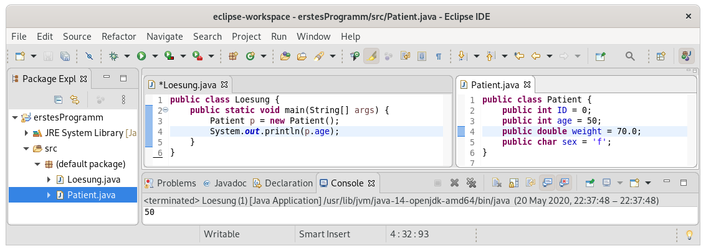

# Objektorientierte Programmierung

In den frühen Jahren der Programmierung wurden komplexe Datensätze tatsächlich wie in der letzten Woche gezeigt in miteinander synchronisierten Arrays gespeichert. Wie Sie sich aber vermutlich vorstellen können ist das auf Dauer sehr unbequem und fehleranfällig. Um das eleganter zu lösen wurde das Konzept von Klassen und Objekten entwickelt.

## Grundidee von Klassen und Objekten

Klassen fassen zusammengehörige Daten und Methoden. Dadurch wird die Arbeit mit komplexen Datensätzen bequemer und lange Programme können übersichtlicher organisiert werden.

Beginnen wir mit einem einfachen Beispiel: Anstatt die Daten zu Patienten wie in der letzten Woche in separaten Arrays zu halten, erstellen wir eine Klasse Patient, die die Identifikationsnummer, das Alter und das Geschlecht eines Patienten beinhaltet:

```java
public class Patient {
  public int ID = 0;
  public int age = 50;
  public double weight = 70.0;
  public String name = "Max";
}
```

Achten Sie, wenn Sie das ausprobieren wollen, darauf, vorher eine neue Datei `Patient.java` anzulegen (In Eclipse: Rechtsklick auf den src-Ordner->new->Class), in Java darf pro .java-Datei nur eine Klasse definiert werden und diese muss exakt so heißen, wie die Datei). Diese Daten sind in den Variablen ID, age und sex gespeichert. Da diese Variablen nicht in einer Methode stehen sondern direkt Teil der Klasse sind, werden Sie als Attribute bezeichnet.  

Nun können Sie die Klasse wie einen neuen Datentyp verwenden, beispielsweise in der main-Methode Ihrer Hauptklasse:

```java
public class Loesung {
  public static void main(String[] args) {
    Patient p = new Patient();
  }
}
```

In Eclipse sollte das wie folgt aussehen:



Wie sie sehen können, gibt es gegenüber der Verwendung primitiver Datentypen einige Unterschiede.

## Instanziierung

Zunächst funktioniert die Zuweisung eines neuen Wertes für die Variable anders, als bei primitiven Datentypen. Dort kann direkt ein Wert zugewiesen werden, beispielsweise `int x = 10;` bei einem `int`. Eine Klasse allerdings kann beliebig viele unterschiedliche Werte in diversen Attributen halten, also funktioniert diese Heransgehensweise nicht. Stattdessen wird mit der Anweisung `new` der Speicherplatz, der zum Speichern aller Attribute notwendig ist, vorbereitet - ähnlich wie bei einem Array, nur, dass in einem Array alle Elemente hintereinander liegen und vom gleichen Datentyp sein müssen, die Attribute einer Klasse hingegen unterschiedliche Datentypen haben können und über Namen auf sie zugegriffen werden kann. Zudem werden die Attribute dabei gleich auf die in der Klasse definierten Standardwerte gesetzt. Dieser Vorgang wird als Instanziierung bezeichnet, und eine instanziierte Variable vom Datentyp einer Klasse wird als Objekt dieser Klasse bezeichnet. Die Klasse ist also eine Beschreibung, und ein Objekt ist eine konkrete Ausprägung (Instanz) dieser Klasse mit zugewiesenem Speicher für die Attribute. Es kann beliebig viele Objekte einer Klasse in einem Programm geben.

## Zugriff auf Attribute und Zugriffsmodifikatoren

Mit den Attributen eines Objekts kann auf die gleiche Art interagiert werden, wie mit normalen Variablen. Da es allerdings beliebig viele Objekte einer Klasse in einem Programm geben kann, muss beim Zugriff spezifiziert werden, bei welchem dieser Objekte auf die Attribute zugegriffen werden soll. Die Syntax dafür ist in Java `Objektname.Attributname`. Beispielsweise wird in Zeile 4 in dem folgenden Code der Wert des Attributs `age` aus dem Patient-Objekt `p` ausgegeben:

```java
public class Loesung {
  public static void main(String[] args) {
    Patient p = new Patient();
    System.out.println(p.age);
  }
}
```

Das funktioniert allerdings nur, solange das Attribut in der Klasse als `public` markiert ist: Ein public-Attribut kann von überall im Code aus gelesen und verändert werden. Alternativ können auch die Zugriffsmodifikatoren `private` und `protected` verwendet werden: `private` bedeutet, dass das Attribut nur von Methoden in der Klasse selber (zu denen wir im nächsten Abschnitt kommen) verwendet werden kann. `protected` schränkt den Zugriff auf Methoden der Klasse selber sowie abgeleiteter Klassen ein, womit wir uns befassen wenn wir zur Vererbung von Klassen kommen.

## Klassenmethoden

Das Zusammenfassen konzeptionell zusammen gehörender Informationen in Attributen einer Klasse ist an sich schon eine sehr nützliche Funktion[^1]. Allerdings führt das bei komplexen Programmen auf lange Sicht zu Unübersichtlichkeit. Stellen Sie sich beispielsweise vor, dass Sie häufig die Daten eines Patienten ausgeben wollen. Sie würden also vermutlich eine Methode wie `printData` implementieren, die als Argument ein Patient-Objekt nimmt und die Informationen daraus schön formatiert ausgibt. Wenn Sie in Ihrem Programm aber nicht nur mit Patienten, sonderna auch mit Pflegepersonal arbeiten, benötigen Sie vermutlich eine weitere Klasse `Nurse` - und wenn Sie auch diese Daten ausgeben wollen, brauchen Sie auch für diese Klasse eine Methode `printData`. Eine Lösung ist, die ganzen Methoden umzubenennen: Sie haben dann eine Methode `patient_printData`, eine Methode `nurse_printData` etc. Das wird aber auf Dauer extrem unübersichtlich.

Die Lösung in objektorientierter Programmierung ist, dass Klassen neben Attributen auch Methoden haben können, die Zugriff auf alle Attribute in ihrer jeweiligen Klasse haben. So können nicht nur konzeptionell zusammengehörige Daten, sondern auch die konzeptionell dazu passende Funktionalität in einer Klasse zusammengefasst werden, wie in diesem Beispiel:

```java
public class Patient {
  public int ID = 0;
  public String name = "Max";
  public int age = 50;
  
  public void printData() {
    System.out.print("Patient ID " + ID + " heißt " + name);
  }
}

public class Loesung {
  public static void main(String[] args) {
    Patient p = new Patient();
    p.printData();
  }
}
```

## Constructor

Eine besondere Methode, die in jeder Klasse vorhanden ist, ist der Constructor. Diese Methode wird automatisch aufgerufen, wenn ein neues Objekt mittels `new` erstellt wird. Der Standard-Constructor reserviert nur den notwendigen Arbeitsspeicher und setzt eventuell angegebene Standardwerte für Attribute. Es können aber auch eigene Constructoren implementiert werden, die für die Initialisierung des Objektes notwendige Funktionalität implementieren.

Ein Beispiel für die Verwendung eines solchen Constructors sehen Sie hier:

```java
public class Patient {
  public int ID = 0;
  public int age = 50;
  public double weight = 70.0;
  public double height = 180.0;
  public String name = "Max";
  public double bmi;
  
  public Patient(int ID, int age, int weight, double height, String name) {
    this.ID = ID;
    this.age = age;
    this.weight = weight;
    this.height = height;
    this.name = name;
    calculateBMI();
  }
  
  private void calculateBMI() {
    bmi = 22.5;
  }
  
  public void printData() {
    System.out.println("ID " + ID + ": " + age + " Jahre, BMI " + bmi);
  }
}
```

Zunächst sehen Sie in `public Patient(int ID, int age, int weight, double height, String name)` eine Besonderheit bei der Definition eines Constructors: Es wird kein Datentyp für die Rückgabe angegeben - und es wird auch kein Wert per return zurückgegeben. Stattdessen muss der Constructor genau so heißen, wie die Klasse selber. In diesem Beispiel werden dem Constructor die Werte für die Attribute eines konkreten Patienten übergeben (das ist sehr häufig die Aufgabe eines Constructors: Die Werte für den konkreten Fall, der von dem Objekt abgebildet werden soll, zu setzen). Damit sofort klar ist, welche Attribute auf Basis welcher Argumente gesetzt werden sollen, sind in diesem Beispiel die Argumente des Constructors genau so benannt, wie die Attribute. Das führt allerdings zu einem Problem: Wenn nun in der Methode die Variable `ID` verwendet wird, ist nicht klar, ob die lokale Variable, die als Argument übergeben wurde, gemeint ist, oder das Attribut `ID` - beide heißen ja gleich. In diesem Fall lautet die Konvention, dass immer zunächst die lokale Variable verwendet wird, und nur, wenn es keine lokale Variable mit dem entsprechenden Namen gibt, auf das Klassenattribut zugegriffen wird: Die lokale Variable `überschattet` das Klassenattribut, entsprechend wird dies als "shadowing" bezeichnet. Um explizit, unabhängig von eventuellem shadowing, auf das Klassenattribut zuzugreifen, kann `this` verwendet werden. Dies ist eine spezielle Variable, die das aktuelle Objekt enthält.

Nach dem Setzen der Attributwerte wird noch in Zeile 15 der BMI des Patienten berechnet. Auch das ist eine typische Verwendung eines Constructors: Die Berechnung von abgeleiteten Werten, die zwar nicht direkt übergeben werden, aber direkt bei Initialisierung berechnet werden können, um die spätere Arbeit mit dem Objekt zu ermöglichen. Dafür wird die Methode `calculateBMI` aufgerufen - die in diesem Beispiel private ist. Das bedeutet wie oben beschrieben, dass diese Methode nur von anderen Methoden der selben Klasse aufgerufen werden kann. Da es keinen Grund gibt, weshalb von irgendwo anders im Programm aus, als direkt von der Patient-Klasse aus (bei der Initialisierung, vorausgesetzt das Gewicht ändert sich nie), diese Methode aufgerufen wird, ergibt es Sinn, diese Methode nicht allgemein zugänglich zu machen. 

[^1] Das war auch der erste Schritt, der in diese Richtung getan wurde - die Programmiersprache C unterstützte recht früh das Konzept von Strukturen, die genau das waren: Eine definierte Ansammlung von Variablen, die gemeinsam wie ein neuer Datentyp verwendet werden konnten.