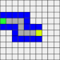
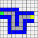

# Woche 1: Grundlegende Algorithmen mit Snap!

Willkommen in Programmierung 1! Auch wenn diese ersten Übungen mit Snap! sehr einfach aussehen: Hier geht es um den Kern der Programmierung. Denn die Programmiersprache ist eigentlich egal: Wenn Sie in der Lage sind, die Lösung für ein Problem im Kopf klar zu formulieren, dann ist es egal, in welcher Programmiersprache Sie sie nachher aufschreiben.

## Aufgabe 0

Legen Sie sich zunächst bei [Snap!](https://snap.berkeley.edu/) einen Account an. Diesen brauchen Sie, um die Aufgaben abzugeben - denn Sie sollen die Aufgaben in Moodle als Link zu einem Snap!-Projekt in Ihrem Profil abgeben. Wie Sie an diesen Link kommen, können Sie in [diesem Video](https://mediathek.htw-berlin.de/video/Abgaben-mit-Snap/4a4e1bb9eda16da2113f1741b688e3a2) sehen.

## Aufgabe 1

In dieser [ersten Aufgabe](https://snap.berkeley.edu/project?user=piotrdabrowski&project=Prog1-Uebung1.1) erstellen Sie einen ganz einfachen Algorithmus, um den Pfeil von dem grünen Feld (links) zum gelben Feld (rechts) zu bringen. Dabei soll der Pfeil nur über graue Felder laufen:

Verwenden Sie dafür zunächst nur die folgenden Blöcke:

* `when start clicked`
* `make a step`
* `turn`
* `teleport back to start`

## Aufgabe 2

In der [zweiten Aufgabe](https://snap.berkeley.edu/project?user=piotrdabrowski&project=Prog1-Uebung1.2) verallgemeinern Sie den Algorithmus aus Aufgabe 1. Sie dürfen nun zusätzlich die folgenden Blöcke verwenden:

* `if`
* `repeat until`
* `stop all`
* `in front of`

Gehen Sie am besten in zwei Schritten vor:

### Aufgabe 2.1

Schreiben Sie einen Algorithmus unter Verwendung der neuen Blöcke, der für die Karte aus Aufgabe 1 funktioniert.

### Aufgabe 2.2

Testen Sie Ihren Algorithmus mit der zweiten Karte (Rechtsklick auf die Karte -> edit, dann den Tab "Backgrounds" auswählen, die untere Karte anklicken, dann auf der rechten Seite unter der Karte den Pfeil "Sprite" auswählen und wieder zum Tab "Scripts" zurückwechseln):

