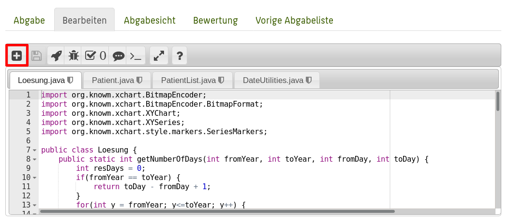
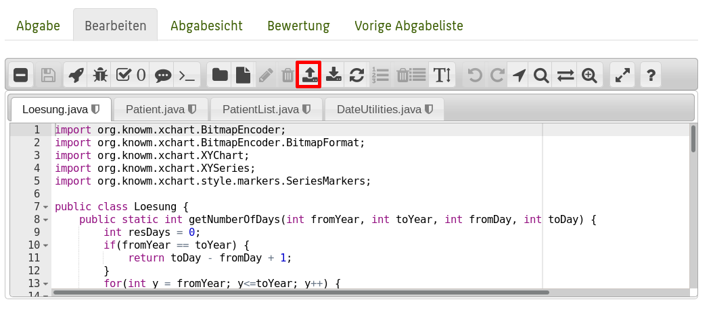
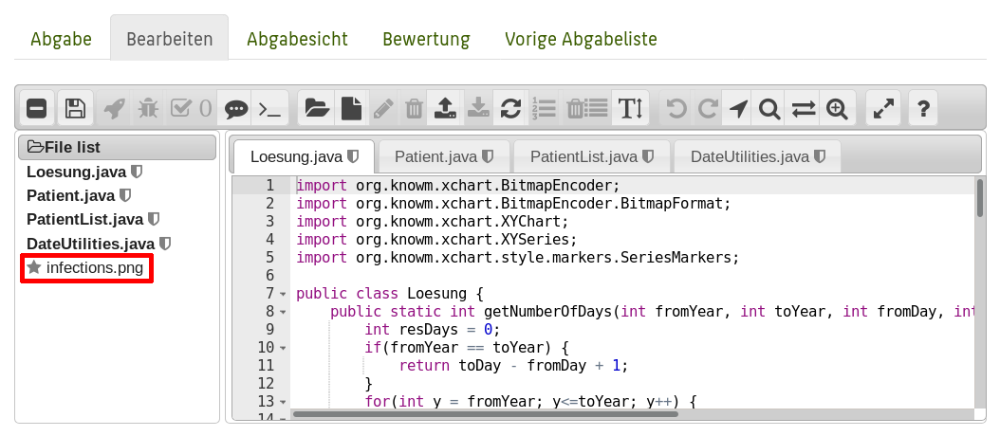
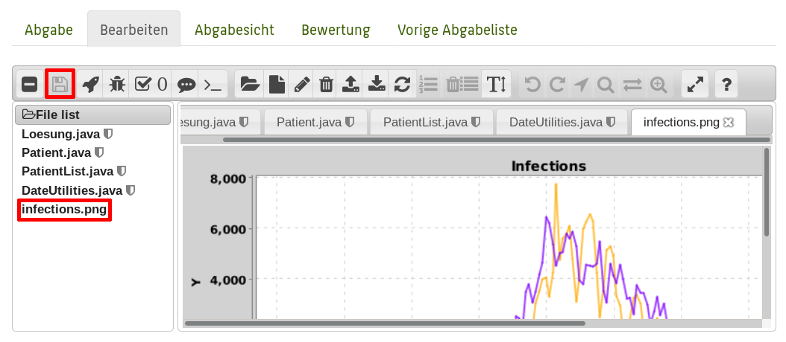

In dieser Übung arbeiten wir weiter mit dem Datensatz mit [Daten zum Infektionsgeschehen](https://github.com/beoutbreakprepared/nCoV2019) aus einer [Nature-Publikation zur Bereitstellung epidemiologischer Daten in der Corona-Krise](https://www.nature.com/articles/s41597-020-0448-0). Diesmal geht es um die Visualisierung der Daten, die Sie eingelesen haben. Einige utility-Funktionen (die ersten Aufgaben) machen Ihnen dabei das Leben beim Implementieren der Visualisierung einfacher.

In dieser Übung werden Sie auf jeden Fall eine eigene Entwicklungsumgebung benötigen. Ich empfehle Ihnen Eclipse, da Sie dort direkt nach den Anweisungen im Skript vorgehen können, aber wenn Sie eigene Präferenzen haben sollten Sie natürlich das benutzen, worin Sie sich am besten fühlen. Wichtig ist, dass Sie eine externe JAR-Datei einbinden und Code ausführen können - da ich im VPL keine Möglichkeit habe, zuverlässig Bilder zu vergleichen (ohne, dass ein veränderter Pixel direkt zu "0 Punkte, da anders" führt), müssen Sie die Bilder bei sich lokal erzeugen und mit der Abgabe für die entsprechende Aufgabe hochladen.

In dieser Aufgabe benötigen Sie als Ausgangspunkt funktionierende PatientList- und Patient-Klassen entsprechend der Spezifikationen aus der letzten Woche - Sie können gerne Ihre eigene aus der letzten Abgabe oder auch die aus der Beispiellösung verwenden. 

## Utility-Funktionen

Implementieren Sie in der Klasse `DateUtilities` die folgenden Methoden:

* `public static boolean isLeapYear(int year)`: Gibt true zurück, wenn das Jahr ein Schaltjahr ist, sonst false. Ein Schaltjahr ist jedes Jahr, das nicht durch 100 teilbar ist, aber durch 4 (Ausnahme: Durch 400 teilbare Jahre sind auch Schaltjahre). Also: 1900 war kein Schaltjahr (durch 100 teilbar), 1904 war eins (durch 4 teilbar). 2000 war auch ein Schaltjahr (da zwar durch 100 teilbar, aber auch durch 400).
* `public static int daysInYear(int year)`: Gibt die Anzahl der Jahre in dem Jahr zurück.
* `public static int daysInMonth(int month, int year)`: Gibt die Anzahl der Tage in dem Jahr zurück. Hinweis: Anstatt 12 if-Abfragen zu machen, können Sie die Tage pro Monat z.B. in einem Array als statisches Klassenattribut speichern. Aber: Beachten Sie, dass es Schaltjahre gibt!

## Patient

Erweitern Sie die Klasse `Patient` um die Methode `public int getDayOfYear()`, die den Tag der Infektion im Jahr zurückgibt (also einen Wert zwischen 1 und 365). Es empfiehlt sich, dafür ein entsprechendes neues Attribut in der Klasse anzulegen und dessen Wert beim Erstellen des Patienten (z.B. in parseCSVLine) aus dem Datum zu berechnen.

Hinweis: Sie können dafür die statischen Utility-Methoden verwenden (z.B. `int monthdays = DateUtilities.daysInMonth(patient.month, patient.year)`).

## PatientList

Erweitern Sie die Klasse `PatientList` um die Methode `public PatientList filterByDayOfYear(int day)`, die eine neue PatientList mit nur den Patienten zurückgibt, deren Diagnose an dem angegebenen Tag in einem Jahr liegt.

## Tägliche Infektionszahlen

Implementieren Sie in `Loesung.java` eine statische Methode `public static int[] dailyInfections(PatientList pl, int fromYear, int toYear, int fromDay, int toDay, boolean cumulative)`, die ein int-Array mit den täglichen Infektionszahlen (inklusive des ersten/letzten angegebenen Tages im ersten/letzten angegebenen Jahr) zurückgibt. Falls cumulative true ist, sollen stattdessen die kumulativen Infektionszahlen (beginnend bei 0 - Sie brauchen nicht alle Infektionszahlen vor fromYear, fromDay vorab zu summieren) zurückgegeben werden. Das bedeutet, dass nicht die Anzahl der Infektionen am jeweiligen Tag, sondern die Anzahl aller Infektionen bis zum jeweiligen Tag inklusive zurückgegeben wird (wenn also z.B. dailyInfections mit `cumulative=false` die Werte "1, 3, 5, 4, 7" zurückgeben würde, würde es mit `cumulative=true` Werte "1, 4, 9, 13, 20" zurückgeben).

## Infektionen plotten

Implementieren Sie eine Methode `public static void plotInfections(int[][] infections, String out, String[] locations)`, die mittels XChart die Daten aus dem übergebenen Array plottet und in der Datei, dessen Pfad durch `String out` übergeben wurde, als PNG-Datei speichert. Dabei ist jedes Array in `int[][] infections` eine Datenreihe (wenn also `infections.length` 3 ist, wären die drei Datenreihen in `infections[0]`, `infections[1]` und `infections[2]`) und `String[] locations` enthält die Namen der Datenreihen.

Hinweis: Verwenden Sie als Referenz das Beispiel aus dem Skript. Sie können mehrere Datenreihen zu einem XYChart-Objekt hinzufügen, indem Sie mehrmals die `addSeries`-Methode des XYChart-Objekts aufrufen. Arbeiten Sie sich (das gilt immer, aber besonders bei der Verwendung neuer Bibliotheken, daher hier nochmals der Hinweis) schrittweise voran: Probieren Sie beispielsweise erst, eine ganz einfache Linie zu zeichnen (z.B. `int[] data = {1, 2, 3};` und dann data plotten und schauen, ob das richtige Bild rauskommt), plotten Sie dann eine Datenreihe aus dailyInfections, und übergeben Sie erst im letzten Schritt tatsächlich ein zweidimensionales Array für mehrere Datenreihen.

Zweiter Hinweis: Im Beispiel im Skript wird `addSeries("Name der Datenreihe", xdata, ydata)` aufgerufen. Es gibt aber auch eine `addSeries`-Methode in XYChart, die nur `ydata` nimmt und dann als x-Werte automatisch die Indices des Arrays (also die Zahlen 1-ydata.length) verwendet: `addSeries("Name der Datenreihe", ydata)`.

Erstellen Sie mit Ihrer Methode `plotInfections` zwei Plots: Einen mit den täglichen Infektionszahlen aus Berlin.csv, Germany.csv und Italy.csv vom 1. Tag von 2020 bis zum 155. Tag von 2020 (Namen der Datenreihen: "Berlin", "Germany", "Italy"), und einen zweiten Plot mit den kumulativen täglichen Infektionszahlen aus Berlin.csv, Germany.csv und Italy.csv im gleichen Zeitraum (Namen der Datenreihen: "Berlin (cum.)", "Germany (cum.)", "Italy (cum.)"). Laden Sie diese beiden Bilder als "infections.png" und "infectionsCumulative.png" im VPL hoch. Für den Upload gehen Sie wie in folgt vor:

Mit dem +-Icon die erweiterten Optionen einblenden:

Datei hochladen:

Hochgeladene Datei auswählen:

Speichern - das Speichern-Icon sollte danach ausgegraut und der Stern neben dem Dateinamen verschwunden sein:

