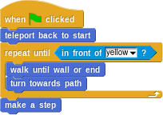

## Aufgabe 1

Schreiben Sie für diese [Aufgabe](https://snap.berkeley.edu/project?user=piotrdabrowski&project=Prog1-Uebung1.3) nun Ihre Lösung mit Hilfe von neuen Blöcken, um sie übersichtlicher zu gestalten. Das Skript soll am Ende so aussehen:

Sie müssen also mindestens die zwei Blöcke `walk until wall or end` (läuft, bis der Pfeil vor einer Wand oder vor dem gelben Feld ist) sowie `turn towards path` (dreht den Pfeil so, dass er in die Richtung zeigt, in die er weiterlaufen sollte) implementieren.

Sie dürfen nun zusätzlich die folgenden Blöcke verwenden, welche zwei Bedingungen miteinander verknüpfen bzw. die Bedingung verneinen:

* `and`
* `or`
* `not`

Hier gibt es mehrere Lösungsansätze - je nach Ansatz werden Sie nicht unbedingt alle Ihnen zur Verfügung stehenden Blöcke benötigen. 

Testen Sie Ihre Lösung wie vorher auch mit der alternativen Karte.

## Aufgabe 2

Ergänzen Sie die Lösung der letzten Aufgabe um das Zählen von Schritten: Fügen Sie eine Ausgabe hinzu, so dass der Pfeil am Ende (wenn er auf dem gelben Feld steht) für 2 Sekunden sagt: "Took X steps to find the exit", wobei `x` die Anzahl an gemachten Schritten sein soll. Sie finden die Aufgabe mit den dafür nötigen Blöcken [hier](https://snap.berkeley.edu/project?user=piotrdabrowski&project=Prog1-Uebung2). Implementieren Sie das auf zwei Arten:

Lösen Sie die Aufgabe, indem Sie eine Zählvariable einführen und diese nach jedem Schrritt um 1 erhöhen (also indem Sie Ihre Lösung der Aufgabe 2 von letzter Woche anpassen)
