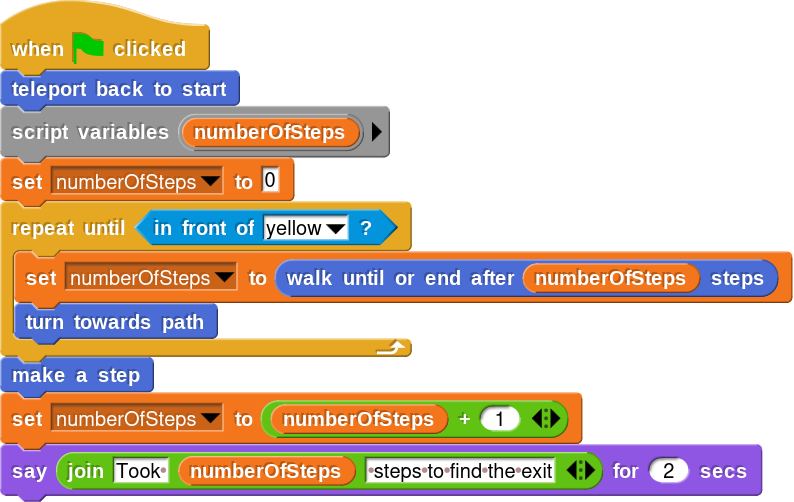
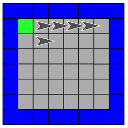
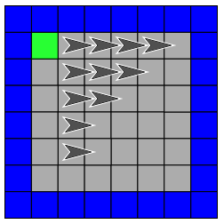

## Aufgabe 1

Lösen Sie die Aufgabe, indem Sie den neuen Block `walk until wall or end` aus Aufgabe 1 der letzten WocheWoche so anpassen, dass sie:

* die Anzahl der bisher gemachten Schritte als Argument bekommt,
* intern die Anzahl der gemachten Schritte mitzählt und
* die neue Anzahl an gemachten Schritten zurückgibt.

Das Skript am Ende sollte also so aussehen:

# Aufgabe 2

Mit dem Block `stamp` (zu finden in der Kategorie `Pen`) können Sie einen Stempel des Sprites auf dem aktuellen Feld hinterlassen.

Verwenden Sie für die nächsten Aufgaben [diesen Link](https://snap.berkeley.edu/project?user=piotrdabrowski&project=Prog1-Uebung3), wo die entsprechenden Blöcke freigeschaltet sind.

Schreiben Sie ein Skript, welches das folgende Muster erzeugt:

Erstellen Sie dafür zwei neue Blöcke: `draw line of x stamps`, welcher `x` Stempel hintereinander erzeugt, sowie `return to beginning of line x`, welcher den Pfeil wieder an den Anfang der Zeile dadrunter bringt (also: Wenn Sie eine Zeile von 4 Stempeln erzeugt haben, sollte `return to beginning of line 4` den Cursor in die Zeile dadrunter bringen, und dafür 4 Schritte zurück laufen). Das Skript, um das obige Bild zu erzeugen (wobei der untere Pfeil kein Stempel ist, sondern der Cursor), sollte also so aussehen:

# Aufgabe 3

Erzeugen Sie nun das folgende Muster (Sie brauchen dafür keine weiteren Custom-Blöcke, verwenden Sie die beiden neuen Blöcke aus Aufgabe 5 weiter):

# Aufgabe 4

Erzeugen Sie nun das folgende Muster (Sie brauchen dafür keine weiteren Custom-Blöcke, verwenden Sie die beiden neuen Blöcke aus Aufgabe 5 weiter):

